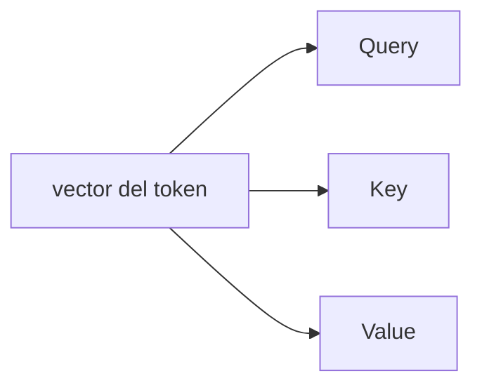
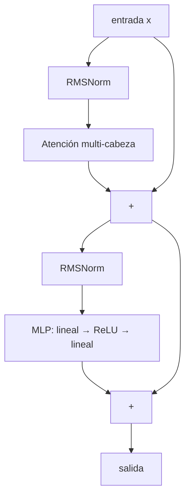
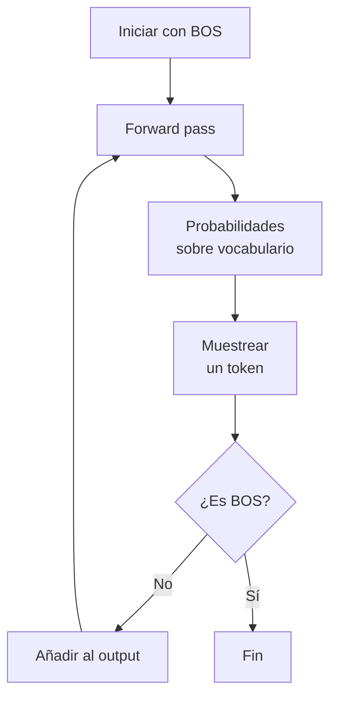

# Cómo funciona un LLM, explicado desde cero

> Documento complementario a `microgpt.py`. Pensado para alguien que **no** tiene formación en matemáticas o programación avanzada, pero quiere entender qué hay realmente dentro de ChatGPT, Claude o Gemini.

---

## Índice

1. [La idea fundamental en una frase](#1-la-idea-fundamental-en-una-frase)
2. [El pipeline completo y la arquitectura Transformer](#2-el-pipeline-completo-y-la-arquitectura-transformer)
3. [Tokenización: del texto a los números](#3-tokenización-del-texto-a-los-números)
4. [Embeddings: dar significado a los tokens](#4-embeddings-dar-significado-a-los-tokens)
5. [El mecanismo de atención: el corazón del transformer](#5-el-mecanismo-de-atención-el-corazón-del-transformer)
6. [El bloque Transformer: la unidad que se apila](#6-el-bloque-transformer-la-unidad-que-se-apila)
7. [De vector a predicción: logits y softmax](#7-de-vector-a-predicción-logits-y-softmax)
8. [Entrenamiento: cómo aprende el modelo](#8-entrenamiento-cómo-aprende-el-modelo)
9. [Inferencia: cómo genera texto nuevo](#9-inferencia-cómo-genera-texto-nuevo)
10. [Glosario rápido](#10-glosario-rápido)
11. [¿Cuántos parámetros tiene el modelo? La fórmula](#11-cuántos-parámetros-tiene-el-modelo-la-fórmula)
12. [Del prototipo al modelo real: `nanogpt_es.py`](#12-del-prototipo-al-modelo-real-nanogpt_espy)
13. [Detalles de ingeniería que aparecen en el código](#13-detalles-de-ingeniería-que-aparecen-en-el-código)
14. [Refuerzos en vídeo: la serie de 3Blue1Brown](#14-refuerzos-en-vídeo-la-serie-de-3blue1brown)

---

## 1. La idea fundamental en una frase

> **Un LLM es un programa que predice el siguiente "trozo de texto" más probable.**

Eso es todo. No "razona" en el sentido humano: ha visto tantísimo texto durante su entrenamiento que se ha vuelto increíblemente bueno adivinando qué viene después. Repitiendo esa predicción una y otra vez genera párrafos, código o conversaciones enteras.

```
Entrada:  "El gato se subió al"
                      |
                      v
              [ MODELO LLM ]
                      |
                      v
Predicción: "tejado"  <-- el token más probable según lo aprendido
```

En `microgpt.py` el modelo aprende sobre **nombres de persona**. Después de entrenar, podrá generar nombres "creíbles" que no existen en sus datos de entrenamiento.

---

## 2. El pipeline completo y la arquitectura Transformer

### 2.1 El pipeline de un vistazo

Cualquier LLM, por gigantesco que sea, sigue este esquema:


| Pieza | Función | Dónde está en `microgpt.py` |
|---|---|---|
| Dataset | Texto del que aprender | `docs = [...]` |
| Tokenizer | Texto ↔ números | `uchars`, `BOS` |
| Embeddings | Token → vector | `state_dict['wte']`, `state_dict['wpe']` |
| Bloques transformer | Procesamiento profundo | bucle `for li in range(n_layer)` |
| Cabeza de lenguaje | Vector → puntuaciones | `state_dict['lm_head']` |
| Pérdida | Mide errores | `loss_t = -probs[target_id].log()` |
| Optimizador | Ajusta parámetros | bloque Adam |

### 2.2 ¿Qué es un Transformer? (la piedra angular)

Casi todo el documento gira alrededor de esta palabra, así que merece la pena pararse aquí. **El Transformer es la arquitectura de red neuronal que está detrás de prácticamente todos los LLMs modernos** (GPT, Claude, Gemini, Llama, Mistral, DeepSeek...). La introdujo Google en 2017 con el paper *Attention Is All You Need* y desde entonces no ha sido destronada.

#### El problema que resolvió

Antes del Transformer, el procesamiento de texto se hacía con **redes recurrentes (RNN, LSTM)**. Funcionaban en serie: leían un token, actualizaban un "estado oculto", leían el siguiente, lo combinaban con el estado, y así sucesivamente. Dos defectos críticos para escalar:

| Problema de las RNN | Por qué duele |
|---|---|
| **Procesamiento secuencial** | No se puede paralelizar: el token N necesita haber procesado el N-1. Se desaprovecha el paralelismo masivo de las GPUs. |
| **Memoria a largo plazo frágil** | Cuando la frase es larga, la información del principio se "diluye" antes de llegar al final. |

El Transformer resuelve ambos problemas de un golpe con una idea: **olvidar la recurrencia y dejar que cada token mire directamente a todos los demás a la vez**. Eso es lo que hace el mecanismo de **atención** (sección 5).

```
   RNN (lo viejo):                   Transformer (lo nuevo):
   ──────────────                    ───────────────────────
   t1 → t2 → t3 → t4 → ...            t1 ─┐
   (un token a la vez,               t2 ─┤
    estado se va perdiendo)          t3 ─┼─► todos miran a todos
                                     t4 ─┘    en paralelo
```

#### El modelo mental: el *residual stream*

La forma más útil de visualizar un Transformer es como un **río de vectores** (uno por token) que fluye **verticalmente** a través de la red. Cada token tiene su propio carril; los carriles no se mezclan salvo cuando atraviesan un bloque de atención.

```
         token_1   token_2   token_3   token_4    ← un vector por token
            │         │         │         │
        ┌───▼─────────▼─────────▼─────────▼───┐
        │           Bloque Transformer 1       │  ← atención + MLP
        └───┬─────────┬─────────┬─────────┬───┘
            │         │         │         │
        ┌───▼─────────▼─────────▼─────────▼───┐
        │           Bloque Transformer 2       │
        └───┬─────────┬─────────┬─────────┬───┘
            │         │         │         │
                       ...
            │         │         │         │
        ┌───▼─────────▼─────────▼─────────▼───┐
        │           Bloque Transformer N       │
        └───┬─────────┬─────────┬─────────┬───┘
            │         │         │         │
            ▼         ▼         ▼         ▼     ← logits → predicción
```

Cada **bloque** (los apilamos N veces, `n_layer = 1` en `microgpt.py`, `12` en GPT-2 small, `96` en GPT-3) hace **dos cosas** sobre ese río:

1. **Atención**: deja que los carriles se "miren" entre sí y se intercambien información — la única operación donde los tokens hablan entre sí.
2. **MLP**: procesa cada carril por separado, refinando el vector con conocimiento aprendido (ver §6).

Tras pasar por los N bloques, el vector del último token se proyecta sobre el vocabulario para predecir el siguiente token. Y se repite.

> **¿Por qué se llama "Transformer"?** Porque cada bloque **transforma** el vector de cada token, refinándolo poco a poco. El primer bloque trabaja con significados muy locales; el bloque 50 ya está manejando ideas abstractas. No hay un paso milagroso: hay 96 transformaciones suaves, cada una aprendida.

#### Decoder-only vs encoder-decoder

El paper original era **encoder-decoder** (pensado para traducción): un encoder leía el español y un decoder generaba el inglés. Los GPT actuales son **decoder-only**: solo el decoder, autorregresivo, que predice el siguiente token a partir del anterior.

| Variante | Quién la usa | Para qué |
|---|---|---|
| **Encoder-only** | BERT, RoBERTa | Clasificación, embeddings, búsqueda |
| **Decoder-only** | GPT, Claude, Llama, este repo | Generación de texto autorregresiva |
| **Encoder-decoder** | T5, BART | Traducción, resumen estricto |

`microgpt.py` y `nanogpt_es.py` son **decoder-only**, igual que ChatGPT. Cada vez que en este documento se diga "Transformer", entendemos esa variante: **bloques apilados, atención causal, generación token a token**.

#### El "secreto" no es ningún componente individual

Si miras la receta — embeddings + atención + MLP + residual + softmax — ninguna pieza es revolucionaria por sí sola. El secreto está en:

1. **Combinar todas estas piezas en un bloque que se puede apilar y paralelizar trivialmente**.
2. **Escalar** ese bloque hasta cantidades absurdas de parámetros y datos.
3. **Que el resultado siga aprendiendo más con más escala** (las llamadas *scaling laws*, ver §11).

Eso es lo que las RNN no podían hacer y los Transformers sí. Por eso son la piedra angular.

> **El resto de este documento** describe cada pieza del Transformer en detalle:
> - §3 y §4 explican cómo entran los tokens (tokenizer + embeddings)
> - §5 desmenuza la **atención**
> - §6 explica un **bloque Transformer completo** y cómo se almacena el conocimiento
> - §7-§9 cubren predicción, entrenamiento e inferencia
> - §11 calcula cuántos parámetros tiene
> - §12 explica las optimizaciones de ingeniería para llevar la idea a producción

---

## 3. Tokenización: del texto a los números

Las redes neuronales solo saben hacer cuentas con números. El **tokenizer** es el traductor.

```
"ana"   ─tokenizer─►   [1, 14, 1]
[1, 14, 1]   ─detokenizer─►   "ana"
```

En `microgpt.py` cada **carácter** es un token (vocabulario muy pequeño, ~27 tokens). En modelos reales se usan **sub-palabras** (BPE), con vocabularios de 50.000–200.000 tokens. Por ejemplo GPT podría partir `"intelligence"` en `["intel", "lig", "ence"]`.

Además existe un token especial **BOS** (*Beginning Of Sequence*) que sirve como marca de inicio/fin:

```
"  ana  "   →   [BOS, a, n, a, BOS]
```

Sin BOS el modelo no sabría cuándo empezar a generar, ni cuándo parar.

---

## 4. Embeddings: dar significado a los tokens

Un número entero (id de token) por sí solo no contiene información semántica. La idea de los **embeddings** es asociar a cada token un **vector** (lista de números), y dejar que el modelo aprenda esos vectores durante el entrenamiento.

```
token_id = 5  ("e")
                 │
                 v
   [-0.21, 0.83, 0.04, ..., 0.55]   <-- vector de 16 dimensiones
       (16 números aprendidos)
```

Después del entrenamiento estos vectores tienen propiedades fascinantes: tokens parecidos están cerca en el espacio vectorial. En modelos grandes incluso se cumplen analogías:

```
vector("rey") - vector("hombre") + vector("mujer")  ≈  vector("reina")
```

### Embedding de posición

La atención (sección 5) por sí sola **no distingue el orden** de los tokens (verla "ana" o "naa" le daría igual). Por eso a cada **posición** se le suma también un vector aprendido:

```
       Token         Posición          Suma (entrada al modelo)
        ↓                ↓                       ↓
  [ vector("a") ]  +  [ vec(pos=0) ]  =  [ vector inicial ]
```

> 📺 **Refuerzo visual:** para ver cómo las palabras se ubican en el espacio vectorial y cómo *direcciones* enteras codifican conceptos, mira el capítulo [*Transformers, the tech behind LLMs*](https://www.youtube.com/watch?v=wjZofJX0v4M) de 3Blue1Brown.

---

## 5. El mecanismo de atención: el corazón del transformer

La **atención** es lo que hace que los transformers (y por tanto los LLMs) sean tan potentes. La introdujo el paper *Attention Is All You Need* (2017).

### La intuición

Cuando lees una frase como:

> *"María dejó las llaves en la mesa porque **ella** estaba apurada."*

Para entender a quién se refiere "ella" miras hacia atrás y prestas más atención a "María" que a "llaves" o "mesa". La atención hace exactamente eso: para procesar cada token, **mira a los tokens anteriores y decide cuánto atender a cada uno**.

Otro ejemplo clásico de desambiguación contextual: la palabra `"banco"` significa cosas distintas en *"me senté en el banco del río"* y en *"el banco me concedió el crédito"*; igual que `"modelo"` no significa lo mismo en *"modelo de aprendizaje automático"* que en *"modelo de moda"*. Es la atención la que mezcla `"río"` o `"crédito"` dentro del vector de `"banco"` para que el modelo capte la diferencia.

### Q, K, V: query, key, value

Cada token genera 3 vectores a partir de su embedding multiplicándolo por **tres matrices de pesos aprendidas**. En `microgpt.py` esas matrices se llaman literalmente `attn_wq`, `attn_wk` y `attn_wv`, y cada una tiene dimensión `n_embd × n_embd`:

| Vector | Matriz en el código | Analogía | Pregunta que responde |
|---|---|---|---|
| **Query (Q)** | `attn_wq` | "lo que estoy buscando" | ¿Qué información necesito? |
| **Key (K)** | `attn_wk` | "etiqueta del contenido" | ¿Qué tipo de información ofrezco? |
| **Value (V)** | `attn_wv` | "el contenido en sí" | Si me eligen, esto es lo que aporto |



### Cómo se calcula la atención

Para cada token actual:

1. **Compara su Q con los K de todos los tokens anteriores** (producto escalar = medida de similitud — cuanto más se parezcan, más alto el número).
2. **Escala dividiendo entre `√d_k`** (donde `d_k` es la dimensión de cada cabeza). Esto es un detalle puramente técnico de "control de volumen": cuando los vectores son largos, los productos escalares salen con números demasiado grandes; el softmax del paso siguiente los interpreta como "este token gana por goleada y los demás no existen", lo que mata el aprendizaje. Dividir entre `√d_k` mantiene los números en una escala razonable. **Si el detalle no te interesa, basta con saber que es una normalización para que el softmax no se descontrole.**
3. Pasa esas puntuaciones por **softmax** para convertirlas en pesos que suman 1 (porcentajes de atención).
4. Mezcla los V de los tokens anteriores **ponderados por esos pesos**: cuanto más alto el peso, más V de ese token se suma.

```
                    Q · Kᵀ
   atención = softmax( ─────── ) · V
                       √d_k
```

Esa es la fórmula completa (*scaled dot-product attention*) del paper original. En código, se ve así de simple en `nanogpt_es.py`:

```python
out = F.scaled_dot_product_attention(Q, K, V, is_causal=True)
```

```
        token actual
          │  (Query)
          ▼
   ┌──────────────────────────────────┐
   │  ¿Cuánto se parece mi Q          │
   │   a la K de cada token anterior? │
   └──────────────────────────────────┘
          │
          ▼  (puntuaciones)
   softmax → pesos que suman 1
          │
          ▼
   suma ponderada de los V
          │
          ▼
   nuevo vector del token (enriquecido con contexto)
```

### Multi-head: varias cabezas a la vez

En lugar de hacer atención una vez, se hace **varias en paralelo** dividiendo el vector en trozos. Cada "cabeza" aprende a fijarse en un aspecto distinto: una en sintaxis, otra en correferencia, otra en posiciones, etc.

```
          vector (dim 16)
         ┌──┬──┬──┬──┐
         │ 4│ 4│ 4│ 4│   ← 4 cabezas de dimensión 4
         └──┴──┴──┴──┘
          h1 h2 h3 h4
   atención atención atención atención
   independiente en cada una
```

Al final se concatenan y se pasan por una matriz final (`attn_wo` en el código) que las "mezcla" antes de entregarle el resultado a la red MLP del bloque.

### Atención causal y enmascaramiento

En un GPT cada token solo puede mirar **tokens anteriores**, nunca futuros: si pudiera ver el siguiente token al entrenar, sería trampa, porque la tarea es justamente predecirlo.

Durante el **entrenamiento** todo el texto se procesa en paralelo (mucho más eficiente), así que el modelo *podría* mirar el futuro si no se lo impedimos. La solución es el **enmascaramiento causal**, una operación matemática muy elegante:

1. Se calcula la cuadrícula completa de puntuaciones `Q · Kᵀ` (similitudes entre todas las queries y todas las keys).
2. **Antes** de aplicar el softmax, las posiciones que corresponden a "tokens futuros" se sobrescriben con `−∞`.
3. Al pasar por el softmax, `exp(−∞) = 0`, así que esos pesos se vuelven **exactamente cero** y las columnas siguen sumando 1.

```
   patrón de atención (T=4)        tras enmascarar          tras softmax
   antes del softmax:                con −∞:                 (causal):

   ┌──┬──┬──┬──┐                  ┌──┬──┬──┬──┐           ┌──┬──┬──┬──┐
   │··│··│··│··│                  │··│-∞│-∞│-∞│           │1 │0 │0 │0 │
   ├──┼──┼──┼──┤                  ├──┼──┼──┼──┤           ├──┼──┼──┼──┤
   │··│··│··│··│  ──enmascarar──► │··│··│-∞│-∞│  ──soft──►│··│··│0 │0 │
   ├──┼──┼──┼──┤                  ├──┼──┼──┼──┤           ├──┼──┼──┼──┤
   │··│··│··│··│                  │··│··│··│-∞│           │··│··│··│0 │
   ├──┼──┼──┼──┤                  ├──┼──┼──┼──┤           ├──┼──┼──┼──┤
   │··│··│··│··│                  │··│··│··│··│           │··│··│··│··│
   └──┴──┴──┴──┘                  └──┴──┴──┴──┘           └──┴──┴──┴──┘
   query del token →               futuros = −∞            futuros = 0
```

El resultado: cada token solo absorbe información de su pasado y presente. La causalidad queda intacta sin necesidad de procesar los tokens uno a uno.

> **Nota — diferencia con atención cruzada:** en arquitecturas encoder-decoder (típicas de traducción) existe la *cross-attention*, donde una secuencia mira a otra. Allí no hay máscara causal, porque no existe el problema de "ver el futuro" — son dos textos distintos. Los GPT solo usan **self-attention causal**.

En `microgpt.py` la atención causal se cumple de forma natural durante la inferencia porque los tokens se procesan uno a uno y la KV-cache solo contiene los anteriores; durante el entrenamiento se procesa el documento completo y sí se necesita la máscara explícita. En `nanogpt_es.py` el enmascaramiento se delega a `F.scaled_dot_product_attention(...)` (Flash Attention, ver §12.3), que aplica internamente el mismo principio sin materializar nunca la cuadrícula `T × T`.

> 📺 **Refuerzo visual:** [*Attention in transformers, step-by-step*](https://www.youtube.com/watch?v=eMlx5fFNoYc) de 3Blue1Brown visualiza cómo Q, K y V trasladan información a través de la frase, incluyendo el patrón de atención y el enmascaramiento.

---

## 6. El bloque Transformer: la unidad que se apila

Como vimos en §2.2, el Transformer es la arquitectura piedra angular de los LLMs, y lo que se "apila" para construirlo es una unidad concreta: **el bloque Transformer**. Esta sección desmonta esa unidad.

Un bloque transformer es una **atención + un MLP**, ambos con conexión residual y normalización. Se apilan N veces (N = `n_layer`).

> 💡 **Nota para programadores — la forma del "río de vectores":** en `nanogpt_es.py` (PyTorch) cada bloque recibe y devuelve un tensor con forma **`(B, T, C)`**:
>
> - **B** = Batch — cuántas secuencias procesamos en paralelo (ej. 32)
> - **T** = Time/Tokens — longitud de la secuencia (ej. 256)
> - **C** = Channels — anchura del residual stream, igual a `n_embd` (ej. 384)
>
> Es decir, el "río de vectores" del modelo mental son literalmente **B ríos paralelos de T tokens, donde cada token es un vector de C dimensiones**. Dentro del bloque, cuando se hace multi-head, el tensor se reshape a `(B, n_head, T, head_dim)` y vuelve a `(B, T, C)` al salir. Si nunca has visto código PyTorch, esta forma `(B, T, C)` es el modelo mental que necesitas tener en mente al leerlo. (Profundizamos en §13.1.)



### ¿Qué hace cada pieza?

- **RMSNorm**: re-escala el vector para que su magnitud sea estable. Sin esto, los números se descontrolan al apilar muchas capas (gradientes que explotan o desaparecen).
- **Atención**: agrega información de tokens anteriores (sección 5). Es la única etapa donde los tokens **se comunican entre sí**.
- **MLP** (*multi-layer perceptron*): pequeña red que procesa cada vector **individualmente, en paralelo, sin que los tokens hablen entre sí**. Se cree que aquí es donde se almacena gran parte del "conocimiento del mundo" del modelo. En modelos gigantes tipo GPT-3, alrededor de **dos tercios de los parámetros totales** viven en los MLP.
- **Conexión residual** (las flechas que rodean los bloques): suma la entrada original a la salida. Permite que la información fluya sin perderse y que el modelo aprenda a "saltarse" capas que no aportan.

> **Atención vs MLP, en una frase:** la atención mira *alrededor* (contexto sintáctico/semántico), el MLP mira *adentro* (conocimiento del mundo memorizado).

### MLP en detalle

```
   vector (16) ──► matriz (16→64) ──► ReLU ──► matriz (64→16) ──► vector (16)
                       expansión                  contracción
```

El "truco" del MLP es expandir a 4× la dimensión, aplicar una no-linealidad y volver a contraer. Sin la no-linealidad la red entera colapsaría a una sola transformación lineal (la composición de transformaciones lineales sigue siendo lineal).

#### ReLU vs GELU

La no-linealidad clásica es **ReLU** (`max(0, x)`): recorta a cero todos los valores negativos y deja los positivos intactos. `microgpt.py` la usa por su transparencia didáctica.

```
   ReLU(x)             GELU(x)
     ▲                   ▲
     │   ╱                │   ╱
     │  ╱                 │  ╱
     │ ╱                  │ ╱
   ──┼──────►           ──┼─╲___────►
     │                    │  curva suave
     0                    0  cerca de 0
   corte brusco         transición suave
```

Los LLMs modernos prefieren **GELU** (*Gaussian Error Linear Unit*), que tiene la misma forma general pero con una curva suave alrededor de cero en vez de un vértice anguloso. Esa suavidad **estabiliza el cálculo de gradientes** durante el entrenamiento. `nanogpt_es.py` usa `nn.GELU()` en su MLP por esa razón.

| Función | Forma | Cuándo aparece |
|---|---|---|
| **ReLU** | `max(0, x)`, vértice angular en 0 | Modelos didácticos, redes simples (`microgpt.py`) |
| **GELU** | curva suave, similar a ReLU pero diferenciable en 0 | LLMs modernos: GPT-2/3/4, Llama, `nanogpt_es.py` |

#### El MLP como memoria de hechos

¿Cómo memoriza un LLM que "Michael Jordan juega al baloncesto"? La intuición clásica (idealizada, ver siguiente sección para el matiz) funciona así dentro de un MLP:

**1. Identificar al sujeto (matriz de expansión + ReLU/GELU como puerta lógica)**

Cuando el vector entra al MLP, la primera matriz lo proyecta a un espacio mucho mayor. Cada *fila* de esa matriz funciona como una pregunta:

> *"¿Apunta este vector simultáneamente en la dirección de 'Michael' Y de 'Jordan'?"*

Si el bloque de atención previo ya mezcló ambas palabras en el vector, el producto escalar con esa fila dará un número positivo alto. Tras restar un sesgo y pasar por ReLU/GELU, **la "neurona" se enciende** (valor > 0) solo cuando ambos conceptos están presentes a la vez. Es decir, la combinación matriz + no-linealidad se comporta como una **puerta lógica AND**.

**2. Inyectar el hecho (matriz de contracción)**

La segunda matriz hace lo opuesto: cada *columna* indica qué concepto se sumará al vector si su neurona correspondiente está encendida. La columna asociada a la neurona de "Michael Jordan" apunta en la dirección conceptual de "baloncesto". Como esa neurona está activa, el vector sale del MLP con "baloncesto" sumado, y eso es lo que más adelante permitirá al modelo predecir esa palabra.

```
   vector con "Michael Jordan"           vector con "Michael Jordan + baloncesto"
              │                                          ▲
              ▼                                          │
   ┌──────────────────────────────────────────────────────┐
   │  MLP                                                  │
   │                                                       │
   │   matriz expansión ──► ReLU/GELU ──► matriz contracción│
   │       (pregunta:           (puerta        (concepto a   │
   │     ¿es Jordan?)            AND)        inyectar:        │
   │                                          baloncesto)     │
   └──────────────────────────────────────────────────────┘
```

> 📺 **Refuerzos visuales:**
> - [*But what is a neural network?* (capítulo 1)](https://www.youtube.com/watch?v=aircAruvnKk) de 3Blue1Brown explica qué es un parámetro, qué hace una capa lineal y por qué ReLU reemplazó a la sigmoide.
> - [*How might LLMs store facts*](https://www.youtube.com/watch?v=9-Jl0dxWQs8) de 3Blue1Brown desarrolla con detalle el ejemplo "Michael Jordan → baloncesto" y la idea de neurona como puerta AND.

#### Superposición: por qué cabe muchísimo más de lo que parece

El relato anterior ("una neurona = un hecho") es una idealización útil para entender la mecánica, pero **no es lo que realmente ocurre** en los modelos grandes. Si fuera así, GPT-3 con sus ~50 000 neuronas por MLP solo podría memorizar 50 000 hechos. Eso es ridículamente poco — un Wikipedia mal contado tiene millones.

¿Cómo cabe entonces tantísimo conocimiento en un MLP? Mediante un truco geométrico llamado **superposición**.

**Analogía para programadores: una hash table con tolerancia a colisiones**

Piensa en un diccionario `dict[str, Any]`:
- Si exiges **claves únicas estrictas**, no puedes guardar más entradas que celdas tiene la tabla.
- Si toleras un poco de colisión (resolverla con encadenamiento, *open addressing*, etc.), tu diccionario puede acomodar **muchísimas más entradas** sin perder rendimiento, porque las colisiones casi nunca ocurren si la tabla es lo bastante grande.

El MLP hace algo parecido pero en geometría:
- "Clave única estricta" ≡ vector **exactamente perpendicular** a los demás (a 90°).
- "Tolerar colisión leve" ≡ vector **casi perpendicular** (89°–91° en lugar de 90° exacto).

**El resultado contraintuitivo (lema de Johnson-Lindenstrauss)**

| Restricción | Cuántos conceptos caben en `n` dimensiones |
|---|---|
| Vectores **exactamente** perpendiculares entre sí | `n` (uno por dimensión, sin más) |
| Vectores **casi** perpendiculares (con margen ε) | crece **exponencialmente** con `n` |

No hace falta entender la demostración. La consecuencia práctica es la que importa: en un espacio de 12 288 dimensiones (GPT-3), el número de "claves casi únicas" disponibles es astronómico — muchísimo mayor que el número de neuronas físicas.

```
   tabla hash con claves estrictas:        tabla hash con tolerancia ε:
   ───────────────────────────────         ──────────────────────────
   capacidad = nº celdas                   capacidad ≫ nº celdas
   (ridícula)                              (suficiente para todo Wikipedia)
```

**Qué implica para un LLM**

- **Codificación distribuida:** un hecho como "Michael Jordan → baloncesto" no vive en una neurona aislada, sino en un **patrón** de muchas neuronas encendiéndose a la vez. El patrón es la "clave casi única".
- **Capacidad masiva:** el modelo empaqueta muchísimas más ideas independientes que neuronas tiene. Esto explica por qué los modelos escalan tan bien: duplicar el ancho del modelo (`n_embd`) no duplica la capacidad — la multiplica de forma desproporcionada.
- **Difícil de interpretar:** como las características están entrelazadas en superposición, "abrir" un LLM para ver qué sabe es un reto de investigación abierto. Herramientas como los *sparse autoencoders* intentan precisamente desenredar estas direcciones para hacer el modelo más interpretable.

> **Idea para llevarse:** la atención mueve información *entre tokens*, el MLP procesa cada token *internamente*, y la superposición es lo que permite que ese procesamiento interno almacene cantidades disparatadas de conocimiento. No es magia: es el mismo principio por el que una hash table grande casi nunca colisiona, llevado al extremo en alta dimensión.

---

## 7. De vector a predicción: logits y softmax

Después del último bloque transformer, cada token tiene un vector "enriquecido" de dimensión `n_embd`. Para predecir el siguiente token:

```
   vector final (n_embd=16)
            │
            ▼
   capa lineal `lm_head` (16 → vocab_size)
            │
            ▼
   logits: una puntuación por cada token del vocabulario
            │
            ▼ softmax
   probabilidades que suman 1
```

Ejemplo visual con un vocabulario diminuto:

```
logits   →   "a": 3.2   "n": 1.8   "z": -0.4   BOS: 0.1
                  │         │         │           │
                  ▼ softmax (exp y normaliza)
probs    →   "a": 0.62  "n": 0.18  "z": 0.02  BOS: 0.18
```

El token con mayor probabilidad es la predicción "más segura" del modelo, pero no siempre se elige el máximo (ver sección 9).

---

## 8. Entrenamiento: cómo aprende el modelo

Entrenar = **ajustar los millones de parámetros para que las predicciones sean cada vez mejores**. Se hace con un bucle:


### 8.1 Forward pass

Para cada posición del documento, el modelo predice el siguiente token. Si el documento es `[BOS, a, n, a, BOS]`:

```
  posición 0:  ver "BOS"  →  predecir "a"   (correcto)
  posición 1:  ver "a"    →  predecir "n"   (correcto)
  posición 2:  ver "n"    →  predecir "a"   (correcto)
  posición 3:  ver "a"    →  predecir "BOS" (correcto)
```

### 8.2 Pérdida (loss): cross-entropy

La pérdida mide **cuánto se equivocó** el modelo. La fórmula:

```
loss = -log( probabilidad asignada al token correcto )
```

Intuición:

- Si el modelo asignó **probabilidad 1** al token correcto → `loss = 0` (perfecto).
- Si asignó **probabilidad 0.01** → `loss ≈ 4.6` (mucho error).
- Si asignó **probabilidad ≈ 0** → `loss → ∞` (catástrofe).

```
  prob asignada al correcto   loss
  ─────────────────────────   ────
            1.0                 0.0
            0.5                 0.69
            0.1                 2.30
            0.01                4.60
            0.0001              9.21
```

Penalizamos *exponencialmente* a los modelos que están muy seguros... pero equivocados.

### 8.3 Backward pass: el gradiente

El **gradiente** es la respuesta a la pregunta:

> *"Si subo un poquito este parámetro, ¿la pérdida sube o baja, y cuánto?"*

Calculado para cada uno de los millones de parámetros, nos dice **en qué dirección moverlos para que la pérdida baje**. Si un peso tiene gradiente `3.2` y otro `0.1`, modificar el primero impacta el error **32 veces más** que modificar el segundo: así sabemos qué ajustes son los importantes.

#### La regla de la cadena, intuitivamente

Piensa en una red neuronal como **funciones anidadas** que se llaman unas a otras:

```python
# pseudocódigo: una neurona simplificada
def red(w):
    z = w * x + b           # paso 1: suma ponderada
    a = relu(z)             # paso 2: aplicar no-linealidad
    C = error(a, esperado)  # paso 3: medir el error
    return C
```

Si quieres saber **cuánto cambia `C` cuando mueves un poquito `w`**, no puedes mirar solo el último paso: tienes que rastrear la onda expansiva por toda la cadena de llamadas.

La **regla de la cadena** dice algo muy intuitivo: el efecto total = el producto de los efectos en cada eslabón. Igual que una cadena de poleas o engranajes:

```
        ¿cómo afecta w a C?
        ───────────────────
        |                 |
        ▼                 |
   w cambia z  ─────►  z cambia a  ─────►  a cambia C
   (efecto 1)            (efecto 2)         (efecto 3)
        \                 |                 /
         \________________|________________/
                          │
                          ▼
              efecto total = e1 × e2 × e3
```

En notación matemática se escribe con derivadas parciales:

```
   ∂C     ∂C     ∂a     ∂z
   ── = ── · ── · ──        ← producto de los tres "cuánto cambia X cuando muevo Y"
   ∂w     ∂a     ∂z     ∂w
```

**Si la notación `∂` te suena a chino, ignórala**. La idea de fondo es:

- **`∂C/∂a`** — *si pongo otra activación, ¿cuánto cambia el error?* → relacionado con cómo de lejos estaba la predicción de la respuesta correcta.
- **`∂a/∂z`** — *si la suma interna fuera distinta, ¿cuánto cambiaría la activación?* → la pendiente de ReLU/GELU en ese punto.
- **`∂z/∂w`** — *si muevo este peso, ¿cuánto se mueve la suma interna?* → resulta ser igual al valor de la entrada (la activación de la neurona anterior). Esto explica una idea bonita: **un peso se ajusta más cuando la neurona que alimenta estaba muy "encendida"** — es la versión matemática de "lo que se usa, se aprende" (Hebb).

#### El recorrido recursivo hacia atrás

Una vez sabemos cómo ajustar la última capa, podemos calcular **cómo querríamos que cambiara la activación de la penúltima capa** y tratar a esa como si fuera la nueva "capa final". El proceso se repite en reversa, capa por capa, hasta llegar a los embeddings.

**Múltiples caminos:** una neurona suele estar conectada a muchas neuronas de la capa siguiente. Si su activación influye en el costo por *varios caminos distintos*, la regla de la cadena dice: **calcula la derivada por cada camino y súmalas**.

```
   forward:   x ──► op1 ──► op2 ──► op3 ──► loss
                                              │
   backward:  ◄── grad ◄── grad ◄── grad ◄────┘
              (propagamos hacia atrás aplicando la regla de la cadena)
```

Calcular esto a mano para una red de miles de millones de parámetros es inviable. Por eso existe el **autograd** (diferenciación automática):

#### Autograd: la regla de la cadena automatizada

El motor de autograd hace dos cosas:

1. **Durante el forward pass**, registra cada operación (suma, multiplicación, ReLU...) construyendo un **grafo de operaciones**.
2. **Durante el backward pass**, recorre ese grafo en reversa aplicando la regla de la cadena nodo a nodo, calculando automáticamente el gradiente de cada parámetro.

En este repositorio se ve autograd en **dos niveles distintos** que ilustran exactamente la misma idea:

| Implementación | Ubicación | Cómo opera |
|---|---|---|
| **Manual y didáctica** | clase `Value` y método `backward()` en `microgpt.py` | Procesa números **escalar a escalar**. Cada `Value` guarda sus operandos hijos y la derivada local; `backward()` resuelve el orden topológico del grafo y propaga gradientes desde la raíz a las hojas. Lento pero transparente. |
| **Industrial y automática** | autograd de PyTorch en `nanogpt_es.py` | La misma regla de la cadena, pero sobre **tensores** procesados en paralelo masivo en GPU. Aceleración típica vs CPU: 10×–100×. |

> **Mini-batch y promedio:** ajustar pesos basándose en un solo ejemplo desestabiliza el entrenamiento. En la práctica se calcula el gradiente sobre un **mini-batch** de ejemplos y se promedia. Esa media es la que entra al optimizador.

> 📺 **Refuerzos visuales:**
> - [*Gradient descent, how neural networks learn* (capítulo 2)](https://www.youtube.com/watch?v=IHZwWFHWa-w) — la intuición de "bajar la colina" del error.
> - [*Backpropagation, intuitively* (capítulo 3)](https://www.youtube.com/watch?v=Ilg3gGewQ5U) — cómo la red distribuye la "culpa" del error hacia atrás.
> - [*Backpropagation calculus* (capítulo 4)](https://www.youtube.com/watch?v=tIeHLnjs5U8) — la matemática exacta de la regla de la cadena. Ideal para entender la clase `Value` línea a línea.

### 8.4 Optimizador Adam

Una vez tenemos los gradientes, hay que **mover los parámetros**. La forma más simple sería:

```
nuevo_param = param - learning_rate * gradiente
```

(*"resta una pizca del gradiente"*). Esto se llama **descenso por gradiente** y funciona, pero tiene problemas: oscila como un coche con la suspensión rota, va lentísimo en tramos planos, y no distingue entre parámetros que necesitan pasos grandes y los que necesitan pasos pequeños.

**Adam** lo arregla con una analogía muy útil: piensa en el optimizador como un **GPS de coche** que ajusta la velocidad según las condiciones. Mantiene **dos memorias** por parámetro:

| Memoria | Qué guarda | Analogía del GPS |
|---|---|---|
| `m` | Media móvil del gradiente | **La dirección reciente** ("últimamente he ido al norte → seguramente sigo yendo al norte") |
| `v` | Media móvil del gradiente al cuadrado | **La irregularidad del terreno** ("las últimas señales han ido dando bandazos → desconfía de la lectura actual") |

Al dar el paso, Adam combina ambas: divide `m` (dirección) entre `√v` (irregularidad).

```
   gradiente estable        gradiente ruidoso
   y consistente:           y errático:
   ───────────────►         ↗↘↗↘↗↘↗↘
   m grande, v pequeño      m pequeño, v grande
   → paso grande            → paso pequeño
   "voy seguro,             "no me fío,
    acelero"                 voy con pies de plomo"
```

Resultado: Adam **avanza rápido por carretera recta y aminora en curvas cerradas**, sin que tengas que afinar la velocidad a mano para cada parámetro. Por eso es el optimizador estándar.

### 8.5 Curva de pérdida típica

A medida que avanzan los pasos de entrenamiento, la pérdida baja:

```
  loss
   ▲
   │\
   │ \
   │  \___
   │      \____
   │           \________
   │                    \________________
   │                                     \________
   └──────────────────────────────────────────────► steps
```

En `microgpt.py` verás cómo `loss` empieza alrededor de `log(vocab_size) ≈ 3.3` (un modelo aleatorio) y baja hasta valores mucho menores tras 1000 pasos.

---

## 9. Inferencia: cómo genera texto nuevo

Tras entrenar, **usamos** el modelo. La generación es un bucle:



### Temperatura: creatividad vs. coherencia

Antes de muestrear, los logits se dividen por una **temperatura** `T`:

```
   probs = softmax(logits / T)
```

| Temperatura | Comportamiento |
|---|---|
| `T → 0` | Casi siempre el más probable (determinista, repetitivo) |
| `T = 1` | Probabilidades nativas |
| `T = 0.5` | Equilibrio: coherente con algo de variedad (default en `microgpt.py`) |
| `T > 1` | Más caos y "creatividad" (también más errores) |

```
T baja:  distribución concentrada    T alta:  distribución plana
       ▲ ████                              ▲
       │ ████                              │  ▒▒  ▒▒  ▒▒  ▒▒
       │ ████                              │  ▒▒  ▒▒  ▒▒  ▒▒
       └─────────►                         └─────────────────►
        a  b  c  d                          a   b   c   d
```

### Muestreo

Con las probabilidades, se elige un token al azar **ponderado** por ellas. Por eso cada ejecución del bloque de inferencia da nombres distintos.

---

## 10. Glosario rápido

| Término | Significado breve |
|---|---|
| **Token** | Trozo mínimo de texto (carácter, sub-palabra...) |
| **Vocabulario** | Conjunto de todos los tokens posibles |
| **Embedding** | Vector aprendido que representa un token |
| **Logit** | Puntuación bruta antes del softmax |
| **Softmax** | Función que convierte puntuaciones en probabilidades |
| **Atención** | Mecanismo que mezcla información de tokens anteriores |
| **Q, K, V** | Query, Key, Value: vectores derivados de cada token |
| **Atención causal** | Variante donde un token solo puede mirar al pasado (enmascarando el futuro con `−∞` antes del softmax) |
| **Scaled dot-product** | Variante estándar de atención: `softmax(Q·Kᵀ / √d_k) · V` |
| **Cabeza** | Una "instancia" paralela de atención |
| **Capa / Bloque** | Una unidad atención+MLP. Se apilan N veces |
| **MLP** | Mini-red feed-forward (lineal → no-linealidad → lineal) |
| **ReLU** | No-linealidad clásica: `max(0, x)`, vértice anguloso en 0 |
| **GELU** | No-linealidad suavizada de ReLU. Estándar en LLMs modernos |
| **Superposición** | Codificación de muchas más características que neuronas, usando direcciones casi-perpendiculares |
| **Johnson-Lindenstrauss** | Lema que permite la superposición: la capacidad de vectores casi-⟂ crece exponencialmente con la dimensión |
| **RMSNorm / LayerNorm** | Normalización que estabiliza magnitudes |
| **Conexión residual** | Sumar la entrada a la salida (atajo) |
| **Loss** | Número que mide el error del modelo |
| **Cross-entropy** | Loss estándar: `-log(prob del token correcto)` |
| **Gradiente** | Derivada: dirección en la que la loss aumenta |
| **Regla de la cadena** | Identidad del cálculo que permite calcular el gradiente de funciones compuestas multiplicando derivadas locales |
| **Backprop** | Algoritmo para calcular gradientes recorriendo el grafo en reversa |
| **Autograd** | Motor que automatiza la regla de la cadena (clase `Value` en `microgpt.py`, PyTorch en `nanogpt_es.py`) |
| **Adam / AdamW** | Optimizadores adaptativos. AdamW separa el weight decay del gradiente |
| **Weight decay** | Regularización que encoge los pesos para evitar que crezcan sin control |
| **Warmup + cosine** | Schedule del learning rate: subida lineal y decaimiento cosenoidal |
| **Learning rate** | Tamaño del paso en cada actualización |
| **Forward pass** | Cálculo de la predicción a partir de la entrada |
| **Backward pass** | Cálculo de gradientes recorriendo hacia atrás |
| **Inferencia** | Usar el modelo entrenado (sin entrenar) |
| **Temperatura** | Parámetro que controla la aleatoriedad al muestrear |
| **Top-k / top-p** | Estrategias que recortan la cola de tokens improbables antes de muestrear |
| **Flash Attention** | Implementación de atención que evita materializar la matriz `T × T` |
| **KV-cache** | Caché de Keys y Values para no recalcular en inferencia |
| **BOS / EOS** | Begin/End Of Sequence: tokens especiales de marca |
| **Pre-norm / post-norm** | Si la normalización va antes o después del subbloque. Pre-norm es el estándar moderno, más estable en redes profundas |
| **Inicialización** | Sortear los pesos iniciales con `normal(0, 0.02)`. Mal inicializada, una red no entrena |
| **Bias correction** | Corrección en Adam (`m_hat`, `v_hat`) que compensa que las medias móviles arrancan en cero |
| **Dropout** | Regularización: apagar aleatoriamente un % de neuronas durante el entrenamiento |
| **Overfitting** | El modelo memoriza el train set en lugar de generalizar; se detecta cuando la val loss sube mientras la train baja |
| **Checkpoint** | Fichero (`.pt`) con los pesos del modelo en un momento dado, para guardar/cargar |
| **`(B, T, C)`** | Forma estándar de tensores en transformers: Batch, Tokens, Channels (= `n_embd`) |
| **`torch.no_grad()`** | Desactiva el grafo de autograd. Úsalo siempre en inferencia/validación |
| **GradScaler** | Truco para entrenar en `float16` evitando que los gradientes se redondeen a cero |

---

## 11. ¿Cuántos parámetros tiene el modelo? La fórmula

Una pregunta natural al ver hiperparámetros como `n_layer`, `n_embd`, `block_size`, `n_head`... es: **¿cuántos pesos genera todo eso?** Resulta que se puede calcular **exactamente** sumando las dimensiones de cada matriz que se crea en `state_dict`.

> 💡 **Si las cuentas no son lo tuyo**, salta directamente a la [tabla de comparación con LLMs reales](#y-los-modelos-de-verdad) al final de la sección. La idea importante es que **el número de parámetros crece sobre todo con el cuadrado de `n_embd`** — duplicar el ancho del modelo cuadruplica los parámetros.

### Fórmula exacta para `microgpt.py`

| Matriz | Dimensión | Nº parámetros |
|---|---|---|
| `wte` (token embedding) | `vocab_size × n_embd` | `vocab_size · n_embd` |
| `wpe` (position embedding) | `block_size × n_embd` | `block_size · n_embd` |
| `lm_head` | `vocab_size × n_embd` | `vocab_size · n_embd` |
| `attn_wq` | `n_embd × n_embd` | `n_embd²` |
| `attn_wk` | `n_embd × n_embd` | `n_embd²` |
| `attn_wv` | `n_embd × n_embd` | `n_embd²` |
| `attn_wo` | `n_embd × n_embd` | `n_embd²` |
| `mlp_fc1` | `4·n_embd × n_embd` | `4 · n_embd²` |
| `mlp_fc2` | `n_embd × 4·n_embd` | `4 · n_embd²` |

Las 4 matrices de atención suman `4·n_embd²` y la MLP suma `8·n_embd²`. Total: **`12·n_embd²` por capa transformer**.

```
                ┌─ embeddings ────────────┐  ┌─ posición ──┐  ┌─ bloques transformer ──┐
   N_params  =  2 · vocab_size · n_embd   +  block_size·n_embd  +  n_layer · 12 · n_embd²
```

### Comprobación con `microgpt.py`

Con `vocab_size ≈ 27`, `n_embd = 16`, `block_size = 16`, `n_layer = 1`:

```
   2 · 27 · 16  +  16 · 16  +  1 · 12 · 16²
       864      +    256    +     3 072      =  4 192 parámetros
```

Que coincide con lo que imprime `print(f"num params: {len(params)}")` al ejecutar el script.

### ¿Y `n_head`?

**`n_head` no aparece en la fórmula**. No añade parámetros: solo decide cómo se *parte* el vector de tamaño `n_embd` en trozos paralelos para la atención. La única restricción es que `n_embd` sea divisible por `n_head`.

```
   n_embd = 16, n_head = 4   →   4 cabezas de dimensión 4
   n_embd = 16, n_head = 2   →   2 cabezas de dimensión 8
   n_embd = 16, n_head = 8   →   8 cabezas de dimensión 2
              (mismos parámetros totales en los tres casos)
```

### Regla aproximada para LLMs grandes

Cuando el modelo es grande, el término cuadrático en `n_embd` domina y los embeddings se vuelven despreciables:

```
   N  ≈  12 · n_layer · n_embd²
```

Comprobación con **GPT-3** (`n_layer = 96`, `n_embd = 12 288`):

```
   12 · 96 · 12 288²  ≈  174 000 000 000   →   ≈ 175 B ✅
```

### Leyes de escalado: ¿cuántos datos hace falta?

Una vez sabes cuántos parámetros tiene el modelo, ¿cuántos tokens de entrenamiento necesitas? Hay dos referencias clásicas:

| Ley | Año | Recomendación |
|---|---|---|
| **Kaplan et al.** | 2020 | tokens de entrenamiento ≈ `N` |
| **Chinchilla (Hoffmann et al.)** | 2022 | tokens ≈ **`20 · N`** (óptimo por FLOP) |

Y el **coste computacional** del entrenamiento se aproxima por:

```
   FLOPs  ≈  6 · N · D
```

donde `N` = nº de parámetros y `D` = nº de tokens de entrenamiento. Con esto puedes estimar de antemano cuánta GPU necesitas para entrenar un modelo de un cierto tamaño.

```
   ┌──────────────┐         ┌──────────────┐         ┌──────────────┐
   │ hiperparams  │ ──────► │ N parámetros │ ──────► │ D tokens     │
   │ (n_embd, etc)│ fórmula │              │ Chinch. │ (D ≈ 20·N)   │
   └──────────────┘         └──────────────┘         └──────┬───────┘
                                    │                       │
                                    └──────────┬────────────┘
                                               ▼
                                        FLOPs ≈ 6·N·D
                                        (coste de entrenar)
```

---

## ¿Y los modelos de verdad?

`microgpt.py` y un GPT-4 son **el mismo algoritmo**. Lo que cambia es la escala:

| Magnitud | microgpt.py | GPT-2 small | GPT-3 | GPT-4 / Claude (estimado) |
|---|---|---|---|---|
| Parámetros | ~miles | 124 M | 175 B | cientos de miles de millones |
| Capas (`n_layer`) | 1 | 12 | 96 | >100 |
| Dimensión (`n_embd`) | 16 | 768 | 12 288 | desconocida |
| Cabezas (`n_head`) | 4 | 12 | 96 | desconocida |
| Contexto (`block_size`) | 16 | 1 024 | 2 048 | hasta 1 000 000 |
| Datos de entrenamiento | ~30 KB | ~40 GB | ~570 GB | trillones de tokens |
| Hardware | tu portátil | una GPU | miles de GPUs | decenas de miles |

**Pero el código es esencialmente el mismo**. Por eso este archivo es tan valioso: si entiendes `microgpt.py`, entiendes la base de cualquier LLM moderno.

---

## 12. Del prototipo al modelo real: `nanogpt_es.py`

`microgpt.py` es perfecto para entender los conceptos, pero su Python puro no aguanta texto en cantidades reales. El archivo **`nanogpt_es.py`** que acompaña a este repositorio es la versión "industrial" del mismo algoritmo, ya entrenable sobre el [Spanish Billion Words Corpus](http://cs.famaf.unc.edu.ar/~ccardellino/SBWCE/) (~10 GB de castellano limpio).

El **algoritmo es idéntico**. Lo que cambia son las técnicas de implementación que aparecen en cualquier LLM moderno. Esta sección explica esas técnicas nuevas.

### 12.1 Tensores en lugar de escalares

En `microgpt.py` cada operación se hace con un solo número (`Value`). En `nanogpt_es.py` (PyTorch) se hace con **tensores**: matrices N-dimensionales que se procesan en paralelo en GPU.

```
   microgpt:    a × b              (1 multiplicación)
   nanogpt:     [B, T, C] @ [C, D] (B·T·C·D multiplicaciones a la vez)
```

Una GPU moderna puede hacer billones de estas operaciones por segundo. La aceleración típica vs CPU es de 10–100×.

### 12.2 Mixed precision: bfloat16 y float16

Por defecto los tensores son `float32` (4 bytes/número). Pero los modelos modernos usan **half precision** (2 bytes) durante el forward/backward, manteniendo `float32` solo para el optimizador.

| Tipo | Bytes | Rango | Cuándo usar |
|---|---|---|---|
| `float32` | 4 | ±3.4×10³⁸ | siempre seguro, el doble de memoria |
| `float16` | 2 | ±6.5×10⁴ | rápido pero puede desbordar (necesita `GradScaler`) |
| `bfloat16` | 2 | ±3.4×10³⁸ | rango como fp32, precisión menor — el favorito en GPUs Ampere+ |

Beneficio: **2× memoria, 2-4× velocidad** sin pérdida apreciable de calidad.

### 12.3 Flash Attention

#### El cuello de botella cuadrático

El gran enemigo del contexto largo es que **el patrón de atención crece con el cuadrado del número de tokens**. La matriz `Q · Kᵀ` tiene tamaño `T × T`, donde `T` es la longitud del contexto:

```
   T =   128  →     16 000 puntuaciones
   T = 1 024  →  1 048 576 puntuaciones (≈ 1 M)
   T = 2 048  →  4 194 304 puntuaciones (≈ 4 M)
   T = 8 192  → 67 108 864 puntuaciones (≈ 67 M)
```

Y eso es **por cada cabeza, por cada capa, por cada elemento del batch**. Con `n_layer = 12`, `n_head = 12` y `batch = 32` a `T = 2048`, son **~16 mil millones de números** solo para guardar las puntuaciones de atención. La VRAM de la GPU explota mucho antes de poder llegar a contextos largos.

#### Flash Attention al rescate

**Flash Attention** (Tri Dao, 2022) calcula **el mismo resultado matemático** sin materializar nunca la matriz `T × T`. La idea: procesar la atención por **bloques pequeños** que caben en la memoria rápida (SRAM) de la GPU, fusionando todas las operaciones (producto, escalado, softmax, máscara causal, multiplicación por V) en un único kernel CUDA.

```
   Atención clásica:                Flash Attention:
   ─────────────────                ─────────────────
   1. calcular Q·Kᵀ (T×T)           1. tomar bloque de Q
   2. escalar /√d_k                 2. tomar bloque de K
   3. enmascarar futuro             3. calcular bloque de salida
   4. softmax                          completo en SRAM
   5. multiplicar por V             4. acumular y descartar
                                       el bloque intermedio
   memoria: O(T²)                   memoria: O(T)
   pasadas a HBM: muchas            pasadas a HBM: pocas
   también: ¡más rápido!
```

PyTorch 2.0 lo expone como `F.scaled_dot_product_attention(Q, K, V, is_causal=True)`. Una sola llamada hace todo: producto, escalado por `√d_k`, máscara causal y mezcla con V. El resultado matemático es idéntico al de la atención manual de `microgpt.py`; solo cambia la implementación interna.

| Aspecto | Atención manual (`microgpt.py`) | Flash Attention (`nanogpt_es.py`) |
|---|---|---|
| Materializa matriz `T × T` | sí | no |
| Memoria | O(T²) | O(T) |
| Velocidad relativa | 1× | 2–4× más rápida |
| Máxima `T` práctica | unos pocos cientos | decenas de miles |

### 12.4 Weight tying

Tanto el embedding de entrada (`wte`) como la cabeza de salida (`lm_head`) son matrices de tamaño `[vocab_size, n_embd]`. **Comparten los mismos pesos**:

```python
self.wte.weight = self.lm_head.weight
```

Justificación: ambas codifican la misma relación token ↔ vector. Compartirlos:
- ahorra `vocab_size · n_embd` parámetros (mucho con vocabularios grandes)
- regulariza el entrenamiento
- mejora la perplejidad (Press & Wolf, 2017)

### 12.5 Optimizador: de Adam a AdamW

Adam (sección 8.4) ya hace lo más importante: ajusta el tamaño de paso por parámetro como un GPS adaptativo. **AdamW** añade un detalle pequeño pero importante.

#### El problema del *weight decay*

El **weight decay** es un truco clásico para evitar que los pesos crezcan demasiado durante el entrenamiento (lo que provoca *overfitting*). La idea: en cada paso, multiplicar los pesos por un factor ligeramente menor que 1, como un "rozamiento" suave que tira de ellos hacia cero.

El Adam original aplicaba este rozamiento *mezclándolo con el gradiente*, lo cual interfería con la lógica de las memorias `m` y `v`. Imagina que tu GPS adaptativo recibe una señal contaminada de "ruido del rozamiento" — los cálculos se distorsionan.

**AdamW** (Loshchilov & Hutter, 2019) lo arregla **aplicando el rozamiento aparte**, *después* del paso del optimizador:

```
   1. Adam calcula su paso normal usando solo el gradiente (sin distorsionar).
   2. Después, encogemos los pesos un poquito (esto es el weight decay).
```

Lo único que cambia respecto a Adam es que el rozamiento se aplica limpio. El resultado: convergencia más estable y mejor generalización.

#### Aplicación selectiva por dimensionalidad

Otro detalle de afinado: `nanogpt_es.py` aplica el *weight decay* **solo a las matrices grandes** (las "importantes"). Los biases y los parámetros de LayerNorm/RMSNorm son vectores pequeños, y regularizarlos perjudica más que ayuda:

| Tipo de parámetro | Weight decay |
|---|---|
| Matrices `Linear`, `Embedding` (2D) | 0.1 (fuerte) |
| Biases, LayerNorm/RMSNorm (1D) | 0 (ninguno) |

### 12.6 Schedule del learning rate: warmup + cosine

`microgpt.py` decae el LR linealmente. Los modelos serios usan un schedule en dos fases:

```
   lr ▲
      │     ┌───────────╮
      │    /             ╲
      │   /               ╲___
      │  /                    ╲___
      │ /                         ╲_______
      │/                                  └─────►
      └─warmup─┤────────cosine decay──────────► iter
```

| Fase | Qué hace | Por qué |
|---|---|---|
| **Warmup** | LR sube linealmente de 0 al máximo (~100–2000 iter) | Al principio del entrenamiento los pesos son aleatorios y los gradientes son ruidosos. Un paso enorme con esa señal caótica puede romper la red (explosión de pérdida). El calentamiento avanza con prudencia hasta que el modelo se estabiliza. |
| **Cosine decay** | LR baja siguiendo una curva de coseno hacia un mínimo (~10% del máximo) | Cerca del final ya estamos cerca del valle de la pérdida. Pasos pequeños permiten *aterrizar* en el mínimo con precisión, sin pasarse de largo ni rebotar. El coseno da una caída más suave que una recta o un escalón. |

Es el schedule de GPT-3, Llama, Chinchilla... Combinado con AdamW se ha convertido en el estándar de facto para entrenar transformers.

### 12.7 Gradient accumulation: batches grandes con poca VRAM

Los modelos rinden mejor con batches grandes (cientos o miles de secuencias). Pero en una sola GPU no caben tantas. Truco: **acumular gradientes** de varios micro-batches antes de hacer `optimizer.step()`.

```
   for accum_step in range(GRAD_ACCUM_STEPS):
       loss = forward(micro_batch) / GRAD_ACCUM_STEPS
       loss.backward()           # acumula gradientes
   optimizer.step()              # actualiza UNA vez con la suma de todos
```

Resultado: efectivamente entrenas con `batch_size · grad_accum_steps`, gastando memoria solo de `batch_size`.

### 12.8 Gradient clipping

Si en una iteración cualquiera los gradientes son enormes (un valor extremo en los datos, una inicialización mala...), el optimizador puede dar un paso descomunal y romper el modelo.

**Gradient clipping**: limitamos la *norma* total de los gradientes a un máximo (típicamente 1.0):

```
   if ||grad|| > 1.0:
       grad = grad * (1.0 / ||grad||)   # reescalamos al máximo permitido
```

Es como un cinturón de seguridad: en el 99% de los casos no hace nada, pero el 1% que sí actúa salva el entrenamiento.

### 12.9 Top-k sampling: cortar la cola larga

En `microgpt.py` muestreamos directamente de la distribución completa. Problema: incluso tras dividir por la temperatura, los miles de tokens "improbables" suman una probabilidad no trivial → de vez en cuando se cuela una elección absurda.

**Top-k sampling**: antes del softmax, ponemos a `-∞` todos los logits que no estén en el top-k:

```
   logits originales:   [3.2, 2.8, 1.5, 0.4, -0.1, ...]   (vocab_size logits)
   top_k = 3:           [3.2, 2.8, 1.5, -∞,  -∞,  ...]
   softmax:             [0.50, 0.34, 0.16, 0, 0, ...]   (suman 1)
```

Resultado: el modelo solo puede elegir entre los `k` candidatos más razonables. Una variante más sofisticada es **top-p / nucleus sampling** (mantiene los más probables hasta acumular probabilidad `p`), usada por GPT-4, Claude, etc.

### 12.10 Tabla resumen: qué añade `nanogpt_es.py`

| Concepto | `microgpt.py` | `nanogpt_es.py` |
|---|---|---|
| Operaciones | escalares | tensores |
| Hardware | CPU 1 hilo | CPU / GPU / Apple Silicon |
| Precisión | float64 (Python) | float32 / bfloat16 / float16 |
| Atención | manual | Flash Attention |
| Embeddings de entrada/salida | independientes | weight tying |
| Optimizador | Adam | AdamW (con grupos) |
| Schedule LR | decay lineal | warmup + cosine |
| Tamaño de batch | 1 documento | grad accumulation |
| Estabilidad | — | gradient clipping |
| Sampling | softmax + temp | softmax + temp + top-k |
| Datos en memoria | todo cargado | `np.memmap` |
| Validación | — | val loss + checkpoint del mejor |

Ninguno de estos cambia la **idea** de un LLM. Son optimizaciones de ingeniería que permiten entrenar modelos grandes en datos grandes en hardware real.

---

## 13. Detalles de ingeniería que aparecen en el código

Si lees `microgpt.py` y `nanogpt_es.py` línea a línea, te tropezarás con piezas que las secciones anteriores no han desarrollado: trucos de estabilidad numérica, decisiones arquitectónicas pequeñas pero importantes, regularización, validación, optimizaciones de PyTorch... Esta sección las recorre todas, agrupadas. Ninguna cambia el algoritmo conceptual; todas son cosas que se entienden mejor al verlas en el contexto del código real.

### 13.1 La forma de los tensores: `(B, T, C)`

En cuanto abres `nanogpt_es.py` ves shapes por todas partes: `(B, T, C)`, `(B, n_head, T, head_dim)`, etc. Es el modelo mental fundamental para leer cualquier código de transformers en PyTorch.

| Letra | Significado | Valor típico |
|---|---|---|
| **B** | Batch size — cuántas secuencias procesamos en paralelo | 32 en `nanogpt_es.py` |
| **T** | Time / Tokens — longitud de la secuencia (= `block_size`) | 256 |
| **C** | Channels / `n_embd` — anchura del residual stream | 384 |

```
   tensor de entrada (B=32, T=256, C=384)
   
        ┌────────────────────┐
        │  ┌──────────────┐  │
        │  │  ┌────────┐  │  │
   B    │  │  │        │  │  │   secuencia 1, tokens 0..255, vector C
        │  │  │        │  │  │   secuencia 2, tokens 0..255, vector C
        │  │  │  ...   │  │  │   ...
        │  │  └────────┘  │  │
        │  └──────────────┘  │
        └────────────────────┘
                T          C
```

`microgpt.py` también procesa "batches", pero de tamaño 1: un solo documento por step, un solo token por iteración interna. Por eso sus tensores son listas planas en lugar de matrices `(B, T, C)`. La ventaja del batch es que **multiplicaciones de matrices de tamaño grande son MUCHO más eficientes en GPU que muchas pequeñas**.

> **Para programadores:** piensa en `(B, T, C)` como un `Array<Array<Array<float>>>`. Cada operación de PyTorch (matmul, softmax, layernorm...) sabe operar sobre estos tensores N-dimensionales sin que tú tengas que escribir bucles `for`. Es lo mismo que NumPy con vitaminas + GPU.

#### ¿Qué es exactamente un "tensor"? La correspondencia con los nombres cotidianos

En el contexto del *deep learning* y de PyTorch, **"tensor" significa simplemente "array multidimensional de números"** — ni más ni menos. La palabra suena pomposa porque viene de la matemática y la física (donde un tensor tiene propiedades geométricas más profundas sobre cómo cambian sus componentes al cambiar de coordenadas), pero en código se reduce a esto.

Cada tensor tiene un **rango** (también llamado *order* o *axes*), que es el número de dimensiones que tiene. Y cada rango tiene un **nombre cotidiano** que ya conoces:

| Rango | Nombre cotidiano | Ejemplo en un LLM |
|---|---|---|
| **0** | **Escalar** (un solo número) | la `loss` final, un sesgo individual, la temperatura |
| **1** | **Vector** (lista 1D) | el embedding de un token: vector de tamaño `C` |
| **2** | **Matriz** (rejilla 2D) | la matriz de pesos `wte`: `(vocab_size, C)` |
| **3** | **Tensor de rango 3** ("cubo") | el residual stream entero: `(B, T, C)` |
| **4** | **Tensor de rango 4** | atención multi-cabeza: `(B, n_head, T, head_dim)` |

Es decir: **un escalar, un vector y una matriz son tensores** — son los tensores de rangos 0, 1 y 2. Cuando subes a 3 o más dimensiones, ya no hay un nombre cotidiano y se queda con el genérico "tensor de rango N" (o simplemente "tensor").

```
   rango 0          rango 1            rango 2              rango 3
   (escalar)        (vector)           (matriz)             (tensor 3D)
   
       42         ┌───┐               ┌───┬───┬───┐        ┌─cube─┐
                  │ 1 │               │ a │ b │ c │       ╱│      │╲
                  │ 2 │               │ d │ e │ f │      ╱ │ ...  │ ╲
                  │ 3 │               │ g │ h │ i │     └──┴──────┴──┘
                  └───┘               └───┴───┴───┘
```

> 📺 **Refuerzo visual sobre tensores:** la serie de 3Blue1Brown **no tiene un vídeo dedicado a tensores**, pese a ser uno de los más pedidos por su comunidad. Si quieres una explicación visual del concepto, dos alternativas que la comunidad recomienda:
> - **[*What's a Tensor?* de Dan Fleisch](https://www.youtube.com/watch?v=f5liqUk0ZTw)** — directo, visual, perfecto para entender los rangos.
> - **[*Tensor Calculus* de eigenchris](https://www.youtube.com/playlist?list=PLJHszsWbB6hrkmmq57lX8BV-o-YIOFsiG)** — más profundo, llega hasta la parte geométrica/física. Recomendado por fans de 3B1B (aunque está hecho en PowerPoint).
>
> Para leer código PyTorch, con la tabla de arriba te sobra. Si te interesa el concepto matemático puro detrás de la palabra (cómo se transforman bajo cambio de base, productos tensoriales, etc.), los vídeos de arriba lo cubren.

### 13.2 Pre-norm vs post-norm

El paper original del Transformer (2017) ponía la normalización **después** de la atención y MLP (post-norm). Los GPT modernos la ponen **antes** (pre-norm). Es una decisión pequeña con grandes consecuencias.

```
   Post-norm (Transformer original):     Pre-norm (GPT-2/3, microgpt.py, nanogpt_es.py):
   ──────────────────────────────         ───────────────────────────────────────────
   x ──► Attn ──► + ──► LN ──► ...        x ──► LN ──► Attn ──► + ──► ...
   │              │                       │                      │
   └──────────────┘                       └──────────────────────┘
   (residual)                             (residual)
   
   La norma actúa sobre la suma            La norma actúa solo sobre la rama,
   residual. Difícil de entrenar          la conexión residual queda intacta.
   en redes profundas.                    Mucho más estable.
```

**Por qué pre-norm gana en redes profundas:** con pre-norm, la conexión residual transporta el vector original sin alterar entre capas. Eso permite a los gradientes fluir limpiamente desde la salida hasta los embeddings, incluso atravesando 96 capas (GPT-3). Con post-norm, cada capa altera la magnitud y los gradientes se descontrolan al apilar.

En `microgpt.py` lo ves explícito:

```python
x_residual = x
x = rmsnorm(x)        # ← pre-norm: normalizamos ANTES
q = linear(x, ...)    #            de la atención
...
x = [a + b for a, b in zip(x, x_residual)]   # residual con el original sin tocar
```

> **Idea para llevarse:** pre-norm hace que el residual stream sea una **autopista limpia** entre la entrada y la salida; cada bloque solo añade pequeños retoques a esa autopista.

### 13.3 Inicialización de pesos: por qué importa el "punto de salida"

Antes del entrenamiento, todos los parámetros valen números aleatorios. **Cómo de "aleatorios"** importa muchísimo: una mala inicialización puede impedir que la red aprenda nada.

`nanogpt_es.py` usa la receta de GPT-2:

```python
def _init_weights(self, module):
    if isinstance(module, nn.Linear):
        torch.nn.init.normal_(module.weight, mean=0.0, std=0.02)
        if module.bias is not None:
            torch.nn.init.zeros_(module.bias)
    elif isinstance(module, nn.Embedding):
        torch.nn.init.normal_(module.weight, mean=0.0, std=0.02)
```

Cada peso se sortea de una **distribución normal con desviación 0.02** (campana muy estrecha alrededor de 0). Esto garantiza:

- **Sesgo cero** (los pesos no empujan al modelo en ninguna dirección de partida).
- **Magnitud pequeña** (las activaciones no explotan en la primera pasada).

#### El truco extra: escalado de proyecciones residuales

Hay un detalle más sutil para redes muy profundas:

```python
for pn, p in self.named_parameters():
    if pn.endswith('c_proj.weight'):
        torch.nn.init.normal_(p, mean=0.0, std=0.02 / math.sqrt(2 * n_layer))
```

Las matrices `c_proj` (las que terminan los subbloques de atención y MLP, justo antes de la suma residual) se inicializan con **desviación más pequeña**, dividida por `√(2·n_layer)`.

**¿Por qué?** Cada capa suma su salida al residual stream. Si cada capa contribuye con magnitud 1, tras 96 capas la magnitud crece como `√96 ≈ 10` y el modelo se desestabiliza. Inicializando estas proyecciones más pequeñas, la varianza acumulada se mantiene controlada al inicio del entrenamiento.

Es una "vacuna" para el entrenamiento de redes profundas. Sin ella, los GPT no entrenarían bien.

### 13.4 Estabilidad numérica del softmax

Mira esta línea de `microgpt.py`:

```python
def softmax(logits):
    max_val = max(val.data for val in logits)
    exps = [(val - max_val).exp() for val in logits]   # ← restamos el max antes de exp
    total = sum(exps)
    return [e / total for e in exps]
```

¿Por qué resta el máximo antes de calcular `exp`? Por **estabilidad numérica**. La función `exp()` crece a velocidad bestial:

```
   exp(10) ≈ 22 026
   exp(100) ≈ 2.7 × 10⁴³
   exp(1000) ≈ overflow (∞)
```

Si los logits son grandes (cosa habitual), `exp(logit)` desborda incluso en `float64`. Truco matemático: como el softmax es **invariante a sumar una constante** a todos los logits, podemos restar el máximo *gratis*:

```
   softmax(x_i)  =  exp(x_i) / Σ exp(x_j)
                 =  exp(x_i - max) / Σ exp(x_j - max)
                                              ↑
                                              ahora todos los exponentes son ≤ 0
                                              → exp() ≤ 1 → no hay overflow
```

Es un trucazo de una línea que llevas haciendo en NumPy y PyTorch sin saberlo: lo aplican internamente todas las implementaciones de softmax de calidad.

> ⚠️ **El error silencioso más común al implementar redes desde cero.** Si alguna vez intentas escribir una red neuronal sin librerías y de repente tu **loss empieza a salir como `NaN`** (Not a Number) sin razón aparente, en el 90 % de los casos el culpable es justo este: un softmax sin la resta del máximo. Pasa así:
>
> 1. Algún logit se vuelve grande (por ejemplo 800).
> 2. `exp(800)` → `inf` en coma flotante.
> 3. La división `inf / inf` produce `NaN`.
> 4. El `NaN` se propaga por la red (cualquier operación con `NaN` da `NaN`).
> 5. El gradiente es `NaN`. El optimizador escribe `NaN` en todos los pesos. **El modelo está muerto** y no sabes por qué.
>
> Es un error sigiloso porque tu código compila, "entrena" feliz durante varios steps, y de pronto la pérdida es `NaN` y nada vuelve a recuperarse. La buena noticia: la solución cabe en una línea (`logits - logits.max()` antes del `exp`) y librerías como PyTorch ya la aplican por dentro. Pero si te aventuras a implementar softmax / cross-entropy / atención manualmente, **acuérdate siempre de restar el máximo**.

### 13.5 Bias correction en Adam

Si miras el bucle de Adam en `microgpt.py`:

```python
m[i] = beta1 * m[i] + (1 - beta1) * p.grad
v[i] = beta2 * v[i] + (1 - beta2) * p.grad ** 2
m_hat = m[i] / (1 - beta1 ** (step + 1))   # ← ¿qué es esto?
v_hat = v[i] / (1 - beta2 ** (step + 1))
p.data -= lr_t * m_hat / (v_hat ** 0.5 + eps_adam)
```

Las dos líneas con `m_hat` y `v_hat` son la **bias correction** de Adam. Sin ellas, el optimizador da pasos minúsculos al inicio del entrenamiento.

**El problema:** las medias móviles `m` y `v` empiezan en cero. En el primer step, con `beta1 = 0.9`:

```
   m[0] = 0.9 * 0  +  0.1 * grad  =  0.1 * grad
                                     ↑
                                     ¡demasiado pequeño!
                                     debería ser ≈ grad, no 0.1·grad
```

Las medias están sesgadas hacia cero durante las primeras iteraciones. La corrección compensa exactamente ese sesgo dividiendo por `(1 - beta^step)`:

```
   step=1, beta=0.9:  m_hat = m / (1 - 0.9^1) = m / 0.1  → escala correcta
   step=2, beta=0.9:  m_hat = m / (1 - 0.9^2) = m / 0.19
   ...
   step=100:          m_hat ≈ m  (la corrección desaparece, como debe)
```

Pequeño detalle matemático, gran impacto: sin esta corrección Adam tarda decenas de iteraciones extra en arrancar.

### 13.6 Dropout: regularización por apagado aleatorio

`nanogpt_es.py` tiene `nn.Dropout` por todas partes (`attn_dropout`, `resid_dropout`, `MLP.dropout`...) controlado por el hiperparámetro `DROPOUT`. ¿Qué es?

**La idea**, sorprendentemente simple: durante el entrenamiento, en cada forward pass, **apaga aleatoriamente un porcentaje p de las neuronas** (les pone activación 0). Durante inferencia, todas funcionan.

```
   forward de entrenamiento (p=0.2, "apaga 20%"):
   
   activaciones:  [0.3, 0.8, -0.1, 0.5, 0.9, -0.4, 0.2, 0.6]
   máscara aleat: [ 1,   0,    1,   1,   0,    1,   1,   1 ]   ← 20% en 0
   resultado:     [0.3, 0.0, -0.1, 0.5, 0.0, -0.4, 0.2, 0.6]
   
   forward de inferencia: usa todas las neuronas, sin máscara.
```

**¿Por qué funciona?** Dos intuiciones:
1. **Anti-coalición:** sin dropout, varias neuronas pueden "conspirar" memorizando ejemplos concretos juntas. Apagarlas aleatoriamente las obliga a aprender características útiles cada una por su lado.
2. **Ensemble implícito:** apagar neuronas aleatorias en cada paso es como entrenar muchas redes ligeramente distintas y promediarlas. Es regularización gratis.

En `nanogpt_es.py` está a `DROPOUT = 0.0` por defecto: con un dataset de 10 GB hay datos de sobra, no hace falta. Si entrenases con un dataset pequeño y vieras *overfitting*, subirías a 0.1 o 0.2.

### 13.7 Overfitting, validación y checkpoints

Esto es el "**¿y para qué tanto aparataje?**" que falta en el documento. Veamos.

#### El problema: overfitting

Una red con suficientes parámetros puede **memorizar literalmente** el dataset de entrenamiento. La train loss baja a casi 0, pero el modelo no ha *aprendido* — solo ha *memorizado*. En texto nuevo se comporta fatal.

```
   loss
    ▲
    │  train ╲___
    │            ╲___
    │                ╲_____
    │                       ╲_____   ← train loss baja siempre
    │
    │  val   ╲___
    │            ╲___
    │                ╲___        ___   ← val loss empieza a SUBIR
    │                    ╲______╱      = overfitting
    │                            ↑
    │                            momento de parar / del mejor checkpoint
    └─────────────────────────────────────► steps
```

#### La solución: validación

Reservamos un **trozo del dataset que el modelo NUNCA ve durante entrenamiento** (10% en `nanogpt_es.py`: `val.bin`). Cada `EVAL_INTERVAL` iteraciones, calculamos la pérdida sobre ese trozo:

```python
if it % EVAL_INTERVAL == 0:
    losses = estimate_loss(model, train_data, val_data, autocast_ctx)
    print(f"[eval] step {it}: train {losses['train']:.4f}  val {losses['val']:.4f}")
```

Si la **val loss sube mientras la train loss baja**, el modelo está overfitting. Es la señal de "estamos memorizando, no generalizando".

#### Checkpoint del mejor modelo

Mientras tanto, guardamos el modelo en disco **solo cuando mejora la val loss**:

```python
if losses['val'] < best_val_loss:
    best_val_loss = losses['val']
    ckpt = {
        'model_state': model.state_dict(),
        'config': dict(...),
        'iter': it,
        'val_loss': losses['val'],
    }
    torch.save(ckpt, CKPT_DIR / 'ckpt.pt')
```

Un **checkpoint** es básicamente un fichero `.pt` (un pickle de PyTorch) con dos cosas:
- `model_state`: todos los pesos del modelo en ese momento.
- `config`: los hiperparámetros con los que se construyó (para poder reconstruir la arquitectura al cargar).

Si el entrenamiento empezara a overfitting al final, no pasaría nada: el `ckpt.pt` guardado es el del mejor momento. Al hacer `sample`, cargamos ese checkpoint y generamos texto con el modelo en su pico.

#### Train mode vs eval mode

Para que la validación dé números limpios hay que desactivar dropout (queremos medir el modelo, no el modelo "ruidoso"):

```python
model.eval()                 # desactiva dropout y otras estocasticidades
# ... medimos val loss ...
model.train()                # vuelve al modo entrenamiento
```

Es un detalle típico de PyTorch que asusta si no sabes para qué sirve: simplemente cambia el comportamiento de capas como `nn.Dropout` y `nn.BatchNorm` entre modos.

### 13.8 Q/K/V fusionados en un solo matmul

En `microgpt.py` Q, K y V se calculan con **tres llamadas separadas** a `linear()`:

```python
q = linear(x, state_dict[f'layer{li}.attn_wq'])
k = linear(x, state_dict[f'layer{li}.attn_wk'])
v = linear(x, state_dict[f'layer{li}.attn_wv'])
```

En `nanogpt_es.py` se hacen las tres **a la vez**, con una sola matriz `c_attn` de tamaño `n_embd × 3·n_embd`:

```python
self.c_attn = nn.Linear(n_embd, 3 * n_embd, bias=bias)
...
qkv = self.c_attn(x)                            # un solo matmul → (B, T, 3·C)
q, k, v = qkv.split(self.n_embd, dim=2)         # partir en tres
```

**¿Por qué fusionar?** Un solo matmul grande es **3× más rápido** en GPU que tres pequeños: hay menos overhead de lanzar kernels CUDA, mejor uso de la memoria caché de la GPU, y el compilador puede optimizar mejor. Matemáticamente es idéntico.

Patrón clásico de optimización GPU: **fusiona operaciones siempre que puedas**.

### 13.9 `torch.no_grad()` en inferencia

En `nanogpt_es.py`, las funciones de inferencia están decoradas con `@torch.no_grad()`:

```python
@torch.no_grad()
def generate(self, idx, max_new_tokens, temperature=1.0, top_k=None):
    ...
```

Y `estimate_loss`:

```python
@torch.no_grad()
def estimate_loss(model, train_data, val_data, autocast_ctx):
    ...
```

**Efecto:** PyTorch deja de construir el grafo de operaciones para autograd. Como en inferencia/validación **no vamos a hacer backward**, el grafo es trabajo desperdiciado. Desactivarlo:

- Ahorra memoria (no se guardan las activaciones intermedias).
- Acelera el cálculo (menos overhead de tracking).

> **Idea para llevarse:** siempre que en PyTorch hagas un forward sin necesitar gradientes, envuélvelo en `with torch.no_grad():` o decora la función con `@torch.no_grad()`. Es gratis y suele dar 2-3× de aceleración.

### 13.10 Forward optimizado en inferencia: solo el último token

En `nanogpt_es.py.GPT.forward()`:

```python
if targets is not None:
    # Modo entrenamiento: calculamos logits para todas las posiciones
    logits = self.lm_head(x)                  # (B, T, vocab_size)
    loss = F.cross_entropy(...)
else:
    # Modo inferencia: solo nos importa el ultimo token (mas barato)
    logits = self.lm_head(x[:, [-1], :])      # (B, 1, vocab_size)
    loss = None
```

**¿Por qué?** Durante el entrenamiento el modelo aprende **simultáneamente** a predecir el siguiente token desde cada posición de la secuencia (es la magia del entrenamiento paralelo de transformers). En inferencia, solo nos interesa **el siguiente token**, así que basta con proyectar el último vector. La proyección `lm_head` puede ser carísima (`n_embd × vocab_size`); proyectar 1 token en lugar de 256 ahorra mucho.

### 13.11 Detalles de optimización GPU/CPU

Pequeños detalles que ves en `nanogpt_es.py` cuya razón merece la pena:

#### `pin_memory()` + `non_blocking=True`

```python
if device == 'cuda':
    x = x.pin_memory().to(device, non_blocking=True)
```

`pin_memory` reserva memoria especial en RAM que la GPU puede leer **directamente sin pasar por el sistema operativo** (DMA). Combinado con `non_blocking=True`, la transferencia CPU→GPU ocurre **en paralelo** mientras la GPU calcula el batch anterior. Sin esto, la GPU se queda esperando datos.

Patrón general en deep learning: **intenta solapar transferencia de datos y cálculo**.

#### `fused=True` en AdamW

```python
use_fused = (DEVICE == 'cuda')
extra = dict(fused=True) if use_fused else dict()
return torch.optim.AdamW(optim_groups, ..., **extra)
```

La versión "fused" del optimizador junta todas las operaciones de actualización (`m`, `v`, `m_hat`, `v_hat`, `p -= ...`) en un único kernel CUDA. Lanzar un kernel grande es más rápido que lanzar muchos pequeños.

#### `GradScaler` para float16

```python
scaler = torch.amp.GradScaler(DEVICE, enabled=(DTYPE == 'float16'))
...
scaler.scale(loss).backward()
scaler.unscale_(optimizer)
torch.nn.utils.clip_grad_norm_(model.parameters(), GRAD_CLIP)
scaler.step(optimizer)
scaler.update()
```

`float16` tiene rango limitado: gradientes pequeños se redondean a 0 ("underflow"). El **GradScaler**:

1. **Multiplica la loss por una constante grande** antes de `backward()`. Eso multiplica los gradientes por la misma constante → ya no son tan pequeños y caben en `float16`.
2. Antes del `optimizer.step()`, **divide los gradientes** por esa constante (los devuelve a su escala correcta).
3. Si detecta que algún gradiente desbordó (overflow), descarta el step y reduce dinámicamente el factor de escala.

`bfloat16` tiene el mismo rango que `float32`, así que **no necesita GradScaler**. Por eso el código pone `enabled=(DTYPE == 'float16')`.

#### Pre-fetch del siguiente batch

```python
for micro_step in range(GRAD_ACCUM_STEPS):
    with autocast_ctx:
        _, loss = model(X, Y)
        loss = loss / GRAD_ACCUM_STEPS
    # Pre-fetch del siguiente batch mientras backward calcula gradientes
    X, Y = get_batch('train', train_data, val_data, ...)
    scaler.scale(loss).backward()
```

Cargamos el **siguiente batch antes** de hacer `backward()` del actual. Mientras `backward()` ocupa la GPU calculando gradientes, la CPU prepara los datos siguientes en paralelo. Otra instancia de "solapar trabajo".

### 13.12 Resumen visual: dónde aparece cada detalle

| Detalle | `microgpt.py` | `nanogpt_es.py` |
|---|---|---|
| Forma `(B, T, C)` | implícita (B=1, listas planas) | explícita en todo el código |
| Pre-norm | ✅ `rmsnorm` antes de cada subbloque | ✅ `LayerNorm` antes (`ln_1`, `ln_2`) |
| Inicialización 0.02 | ✅ `random.gauss(0, 0.08)` (variante didáctica) | ✅ `normal_(0, 0.02)` + escalado en `c_proj` |
| Softmax estable | ✅ resta `max_val` antes de `exp` | delegado a `F.softmax` (lo hace internamente) |
| Bias correction Adam | ✅ explícito (`m_hat`, `v_hat`) | implícito en `AdamW` |
| Dropout | ❌ (no aplicable) | ✅ configurable, default `DROPOUT=0.0` |
| Validación + checkpoints | ❌ | ✅ `EVAL_INTERVAL`, `best_val_loss`, `ckpt.pt` |
| Q/K/V fusionados | ❌ (3 matrices separadas) | ✅ una sola `c_attn` |
| `torch.no_grad()` | ❌ (no aplicable) | ✅ en `generate` y `estimate_loss` |
| Forward optimizado en inferencia | implícito (token a token) | ✅ solo último token cuando no hay `targets` |
| `pin_memory` / `fused` / `GradScaler` | ❌ | ✅ todo |

Estos detalles no son lo que hace que un Transformer funcione **conceptualmente**; son lo que hace que funcione **en la práctica**, sobre hardware real, sin desperdiciar ciclos. Por eso los modelos serios siempre los incluyen.

---

## 14. Refuerzos en vídeo: la serie de 3Blue1Brown

A lo largo de este documento aparecen callouts 📺 que enlazan a capítulos concretos de la serie *Neural Networks / Deep Learning* de **3Blue1Brown**. Es la mejor explicación visual disponible de la mayoría de los conceptos tratados aquí, y se complementa con este documento como teoría escrita.

[**Lista completa de la serie en YouTube**](https://www.youtube.com/watch?v=aircAruvnKk&list=PLZHQObOWTQDNU6R1_67000Dx_ZCJB-3pi)

| Capítulo | Conceptos cubiertos | Sección de este doc |
|---|---|---|
| 1. *But what is a neural network?* | Pesos, capas lineales, ReLU vs sigmoide | §6 (MLP) |
| 2. *Gradient descent, how neural networks learn* | Función de pérdida, descenso por gradiente | §8 |
| 3. *Backpropagation, intuitively* | Cómo se distribuye la "culpa" del error hacia atrás | §8.3 |
| 4. *Backpropagation calculus* | Regla de la cadena, derivadas locales | §8.3 |
| 5. *Transformers, the tech behind LLMs* | Embeddings, espacios latentes, vectores semánticos | §4 |
| 6. *Attention in transformers, step-by-step* | Q/K/V, patrón de atención, máscara causal | §5 |
| 7. *How might LLMs store facts* | MLP como memoria de hechos, superposición | §6 (MLP, JL) |

> Para una correspondencia detallada concepto-por-concepto entre el código (`microgpt.py` / `nanogpt_es.py`) y los vídeos, consulta [`glosario.md`](glosario.md), que actúa como índice cruzado entre piezas concretas del código y los capítulos correspondientes.
