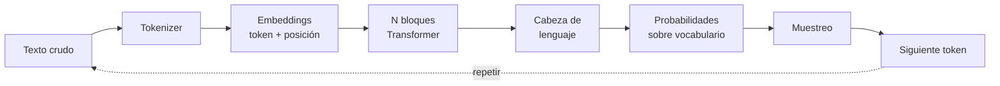
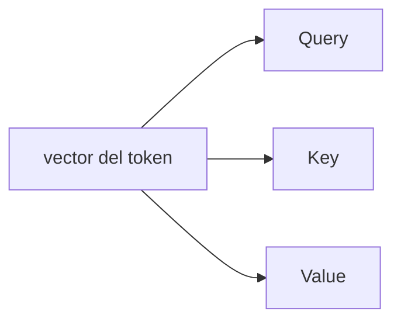
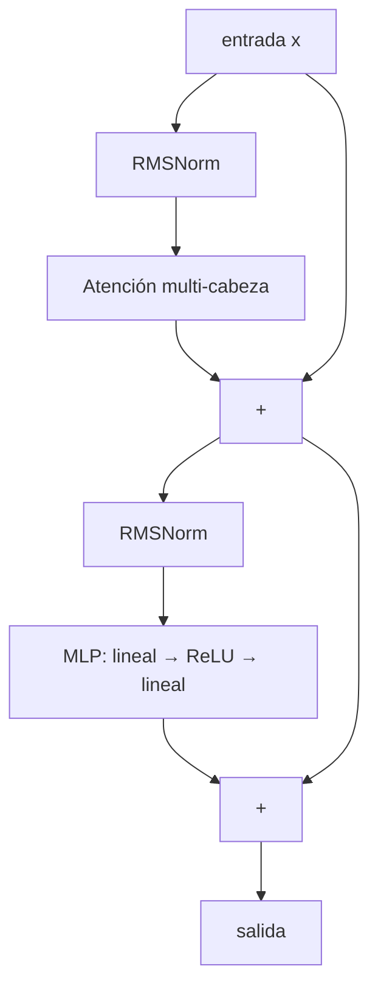
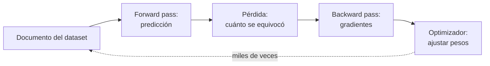
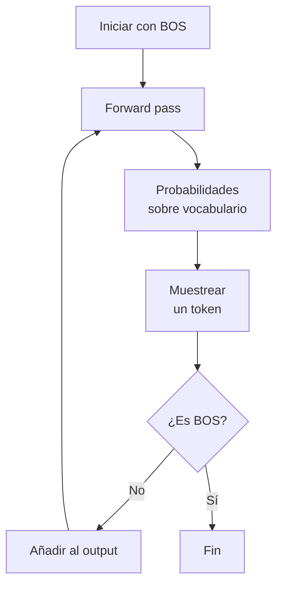

# Cómo funciona un LLM, explicado desde cero

> Documento complementario a `microgpt.py`. Pensado para alguien que **no** tiene formación en matemáticas o programación avanzada, pero quiere entender qué hay realmente dentro de ChatGPT, Claude o Gemini.

---

## Índice

1. [La idea fundamental en una frase](#1-la-idea-fundamental-en-una-frase)
2. [El pipeline completo de un vistazo](#2-el-pipeline-completo-de-un-vistazo)
3. [Tokenización: del texto a los números](#3-tokenización-del-texto-a-los-números)
4. [Embeddings: dar significado a los tokens](#4-embeddings-dar-significado-a-los-tokens)
5. [El mecanismo de atención: el corazón del transformer](#5-el-mecanismo-de-atención-el-corazón-del-transformer)
6. [Un bloque transformer completo](#6-un-bloque-transformer-completo)
7. [De vector a predicción: logits y softmax](#7-de-vector-a-predicción-logits-y-softmax)
8. [Entrenamiento: cómo aprende el modelo](#8-entrenamiento-cómo-aprende-el-modelo)
9. [Inferencia: cómo genera texto nuevo](#9-inferencia-cómo-genera-texto-nuevo)
10. [Glosario rápido](#10-glosario-rápido)
11. [¿Cuántos parámetros tiene el modelo? La fórmula](#11-cuántos-parámetros-tiene-el-modelo-la-fórmula)
12. [Del prototipo al modelo real: `nanogpt_es.py`](#12-del-prototipo-al-modelo-real-nanogpt_espy)

---

## 1. La idea fundamental en una frase

> **Un LLM es un programa que predice el siguiente "trozo de texto" más probable.**

Eso es todo. No "razona" en el sentido humano: ha visto tantísimo texto durante su entrenamiento que se ha vuelto increíblemente bueno adivinando qué viene después. Repitiendo esa predicción una y otra vez genera párrafos, código o conversaciones enteras.

```
Entrada:  "El gato se subió al"
                      |
                      v
              [ MODELO LLM ]
                      |
                      v
Predicción: "tejado"  <-- el token más probable según lo aprendido
```

En `microgpt.py` el modelo aprende sobre **nombres de persona**. Después de entrenar, podrá generar nombres "creíbles" que no existen en sus datos de entrenamiento.

---

## 2. El pipeline completo de un vistazo

Cualquier LLM, por gigantesco que sea, sigue este esquema:



| Pieza | Función | Dónde está en `microgpt.py` |
|---|---|---|
| Dataset | Texto del que aprender | `docs = [...]` |
| Tokenizer | Texto ↔ números | `uchars`, `BOS` |
| Embeddings | Token → vector | `state_dict['wte']`, `state_dict['wpe']` |
| Bloques transformer | Procesamiento profundo | bucle `for li in range(n_layer)` |
| Cabeza de lenguaje | Vector → puntuaciones | `state_dict['lm_head']` |
| Pérdida | Mide errores | `loss_t = -probs[target_id].log()` |
| Optimizador | Ajusta parámetros | bloque Adam |

---

## 3. Tokenización: del texto a los números

Las redes neuronales solo saben hacer cuentas con números. El **tokenizer** es el traductor.

```
"ana"   ─tokenizer─►   [1, 14, 1]
[1, 14, 1]   ─detokenizer─►   "ana"
```

En `microgpt.py` cada **carácter** es un token (vocabulario muy pequeño, ~27 tokens). En modelos reales se usan **sub-palabras** (BPE), con vocabularios de 50.000–200.000 tokens. Por ejemplo GPT podría partir `"intelligence"` en `["intel", "lig", "ence"]`.

Además existe un token especial **BOS** (*Beginning Of Sequence*) que sirve como marca de inicio/fin:

```
"  ana  "   →   [BOS, a, n, a, BOS]
```

Sin BOS el modelo no sabría cuándo empezar a generar, ni cuándo parar.

---

## 4. Embeddings: dar significado a los tokens

Un número entero (id de token) por sí solo no contiene información semántica. La idea de los **embeddings** es asociar a cada token un **vector** (lista de números), y dejar que el modelo aprenda esos vectores durante el entrenamiento.

```
token_id = 5  ("e")
                 │
                 v
   [-0.21, 0.83, 0.04, ..., 0.55]   <-- vector de 16 dimensiones
       (16 números aprendidos)
```

Después del entrenamiento estos vectores tienen propiedades fascinantes: tokens parecidos están cerca en el espacio vectorial. En modelos grandes incluso se cumplen analogías:

```
vector("rey") - vector("hombre") + vector("mujer")  ≈  vector("reina")
```

### Embedding de posición

La atención (sección 5) por sí sola **no distingue el orden** de los tokens (verla "ana" o "naa" le daría igual). Por eso a cada **posición** se le suma también un vector aprendido:

```
       Token         Posición          Suma (entrada al modelo)
        ↓                ↓                       ↓
  [ vector("a") ]  +  [ vec(pos=0) ]  =  [ vector inicial ]
```

---

## 5. El mecanismo de atención: el corazón del transformer

La **atención** es lo que hace que los transformers (y por tanto los LLMs) sean tan potentes. La introdujo el paper *Attention Is All You Need* (2017).

### La intuición

Cuando lees una frase como:

> *"María dejó las llaves en la mesa porque **ella** estaba apurada."*

Para entender a quién se refiere "ella" miras hacia atrás y prestas más atención a "María" que a "llaves" o "mesa". La atención hace exactamente eso: para procesar cada token, **mira a los tokens anteriores y decide cuánto atender a cada uno**.

### Q, K, V: query, key, value

Cada token genera 3 vectores a partir de su embedding (multiplicando por matrices de pesos aprendidas):

| Vector | Analogía | Pregunta que responde |
|---|---|---|
| **Query (Q)** | "lo que estoy buscando" | ¿Qué información necesito? |
| **Key (K)** | "etiqueta del contenido" | ¿Qué tipo de información ofrezco? |
| **Value (V)** | "el contenido en sí" | Si me eligen, esto es lo que aporto |



### Cómo se calcula la atención

Para cada token actual:

1. **Compara su Q con los K de todos los tokens anteriores** (producto escalar = medida de similitud).
2. Convierte esas similitudes en pesos que suman 1 (función *softmax*).
3. Mezcla los V de los tokens anteriores ponderándolos por esos pesos.

```
        token actual
          │  (Query)
          ▼
   ┌──────────────────────────────────┐
   │  ¿Cuánto se parece mi Q          │
   │   a la K de cada token anterior? │
   └──────────────────────────────────┘
          │
          ▼  (puntuaciones)
   softmax → pesos que suman 1
          │
          ▼
   suma ponderada de los V
          │
          ▼
   nuevo vector del token (enriquecido con contexto)
```

### Multi-head: varias cabezas a la vez

En lugar de hacer atención una vez, se hace **varias en paralelo** dividiendo el vector en trozos. Cada "cabeza" aprende a fijarse en un aspecto distinto: una en sintaxis, otra en correferencia, otra en posiciones, etc.

```
          vector (dim 16)
         ┌──┬──┬──┬──┐
         │ 4│ 4│ 4│ 4│   ← 4 cabezas de dimensión 4
         └──┴──┴──┴──┘
          h1 h2 h3 h4
   atención atención atención atención
   independiente en cada una
```

Al final se concatenan y se pasan por una matriz final (`Wo`) que las "mezcla".

### Atención causal

En un GPT cada token solo puede mirar **tokens anteriores**, nunca futuros (sería trampa al entrenar para predecir el siguiente). En `microgpt.py` esto se cumple de forma natural porque se procesan los tokens uno a uno y la KV-cache solo contiene los anteriores.

---

## 6. Un bloque transformer completo

Un bloque transformer es una **atención + un MLP**, ambos con conexión residual y normalización. Se apilan N veces (N = `n_layer`).



### ¿Qué hace cada pieza?

- **RMSNorm**: re-escala el vector para que su magnitud sea estable. Sin esto, los números se descontrolan al apilar muchas capas (gradientes que explotan o desaparecen).
- **Atención**: agrega información de tokens anteriores (sección 5).
- **MLP** (*multi-layer perceptron*): pequeña red que procesa cada vector individualmente. Se cree que aquí es donde se almacena gran parte del "conocimiento del mundo" del modelo (asociaciones tipo "París → Francia").
- **Conexión residual** (las flechas que rodean los bloques): suma la entrada original a la salida. Permite que la información fluya sin perderse y que el modelo aprenda a "saltarse" capas que no aportan.

### MLP en detalle

```
   vector (16) ──► matriz (16→64) ──► ReLU ──► matriz (64→16) ──► vector (16)
                       expansión                  contracción
```

El "truco" del MLP es expandir a 4× la dimensión, aplicar una no-linealidad (ReLU = `max(0, x)`) y volver a contraer. Sin la no-linealidad la red entera colapsaría a una sola transformación lineal.

---

## 7. De vector a predicción: logits y softmax

Después del último bloque transformer, cada token tiene un vector "enriquecido" de dimensión `n_embd`. Para predecir el siguiente token:

```
   vector final (n_embd=16)
            │
            ▼
   capa lineal `lm_head` (16 → vocab_size)
            │
            ▼
   logits: una puntuación por cada token del vocabulario
            │
            ▼ softmax
   probabilidades que suman 1
```

Ejemplo visual con un vocabulario diminuto:

```
logits   →   "a": 3.2   "n": 1.8   "z": -0.4   BOS: 0.1
                  │         │         │           │
                  ▼ softmax (exp y normaliza)
probs    →   "a": 0.62  "n": 0.18  "z": 0.02  BOS: 0.18
```

El token con mayor probabilidad es la predicción "más segura" del modelo, pero no siempre se elige el máximo (ver sección 9).

---

## 8. Entrenamiento: cómo aprende el modelo

Entrenar = **ajustar los millones de parámetros para que las predicciones sean cada vez mejores**. Se hace con un bucle:



### 8.1 Forward pass

Para cada posición del documento, el modelo predice el siguiente token. Si el documento es `[BOS, a, n, a, BOS]`:

```
  posición 0:  ver "BOS"  →  predecir "a"   (correcto)
  posición 1:  ver "a"    →  predecir "n"   (correcto)
  posición 2:  ver "n"    →  predecir "a"   (correcto)
  posición 3:  ver "a"    →  predecir "BOS" (correcto)
```

### 8.2 Pérdida (loss): cross-entropy

La pérdida mide **cuánto se equivocó** el modelo. La fórmula:

```
loss = -log( probabilidad asignada al token correcto )
```

Intuición:

- Si el modelo asignó **probabilidad 1** al token correcto → `loss = 0` (perfecto).
- Si asignó **probabilidad 0.01** → `loss ≈ 4.6` (mucho error).
- Si asignó **probabilidad ≈ 0** → `loss → ∞` (catástrofe).

```
  prob asignada al correcto   loss
  ─────────────────────────   ────
            1.0                 0.0
            0.5                 0.69
            0.1                 2.30
            0.01                4.60
            0.0001              9.21
```

Penalizamos *exponencialmente* a los modelos que están muy seguros... pero equivocados.

### 8.3 Backward pass: el gradiente

El **gradiente** es la respuesta a la pregunta:

> *"Si subo un poquito este parámetro, ¿la pérdida sube o baja, y cuánto?"*

Calculado para cada uno de los millones de parámetros, nos dice **en qué dirección moverlos para que la pérdida baje**. Se calcula con la *regla de la cadena* del cálculo, propagando hacia atrás por el grafo de operaciones (de ahí el nombre **backpropagation**).

En `microgpt.py` esto lo hace la clase `Value` y su método `backward()`. En frameworks reales (PyTorch) ocurre lo mismo, pero con tensores en GPU y mucho más rápido.

```
   forward:   x ──► op1 ──► op2 ──► op3 ──► loss
                                              │
   backward:  ◄── grad ◄── grad ◄── grad ◄────┘
              (propagamos hacia atrás)
```

### 8.4 Optimizador Adam

Una vez tenemos los gradientes, hay que **mover los parámetros**. La forma más simple sería:

```
nuevo_param = param - learning_rate * gradiente
```

Pero esto tiene problemas (oscila, va lento en zonas planas...). **Adam** es una variante popular que mantiene 2 buffers por parámetro:

| Buffer | Qué guarda | Para qué sirve |
|---|---|---|
| `m` | Media móvil del gradiente | "Momentum": si vamos en una dirección, seguimos |
| `v` | Media móvil del gradiente² | Adapta el tamaño del paso por parámetro |

El paso final divide `m` por `√v`, lo que da pasos grandes donde el gradiente es estable y pequeños donde es ruidoso.

### 8.5 Curva de pérdida típica

A medida que avanzan los pasos de entrenamiento, la pérdida baja:

```
  loss
   ▲
   │\
   │ \
   │  \___
   │      \____
   │           \________
   │                    \________________
   │                                     \________
   └──────────────────────────────────────────────► steps
```

En `microgpt.py` verás cómo `loss` empieza alrededor de `log(vocab_size) ≈ 3.3` (un modelo aleatorio) y baja hasta valores mucho menores tras 1000 pasos.

---

## 9. Inferencia: cómo genera texto nuevo

Tras entrenar, **usamos** el modelo. La generación es un bucle:



### Temperatura: creatividad vs. coherencia

Antes de muestrear, los logits se dividen por una **temperatura** `T`:

```
   probs = softmax(logits / T)
```

| Temperatura | Comportamiento |
|---|---|
| `T → 0` | Casi siempre el más probable (determinista, repetitivo) |
| `T = 1` | Probabilidades nativas |
| `T = 0.5` | Equilibrio: coherente con algo de variedad (default en `microgpt.py`) |
| `T > 1` | Más caos y "creatividad" (también más errores) |

```
T baja:  distribución concentrada    T alta:  distribución plana
       ▲ ████                              ▲
       │ ████                              │  ▒▒  ▒▒  ▒▒  ▒▒
       │ ████                              │  ▒▒  ▒▒  ▒▒  ▒▒
       └─────────►                         └─────────────────►
        a  b  c  d                          a   b   c   d
```

### Muestreo

Con las probabilidades, se elige un token al azar **ponderado** por ellas. Por eso cada ejecución del bloque de inferencia da nombres distintos.

---

## 10. Glosario rápido

| Término | Significado breve |
|---|---|
| **Token** | Trozo mínimo de texto (carácter, sub-palabra...) |
| **Vocabulario** | Conjunto de todos los tokens posibles |
| **Embedding** | Vector aprendido que representa un token |
| **Logit** | Puntuación bruta antes del softmax |
| **Softmax** | Función que convierte puntuaciones en probabilidades |
| **Atención** | Mecanismo que mezcla información de tokens anteriores |
| **Q, K, V** | Query, Key, Value: vectores derivados de cada token |
| **Cabeza** | Una "instancia" paralela de atención |
| **Capa / Bloque** | Una unidad atención+MLP. Se apilan N veces |
| **MLP** | Mini-red feed-forward (lineal → no-linealidad → lineal) |
| **RMSNorm** | Normalización que estabiliza magnitudes |
| **Conexión residual** | Sumar la entrada a la salida (atajo) |
| **Loss** | Número que mide el error del modelo |
| **Cross-entropy** | Loss estándar: `-log(prob del token correcto)` |
| **Gradiente** | Derivada: dirección en la que la loss aumenta |
| **Backprop** | Algoritmo para calcular gradientes en una red |
| **Adam** | Optimizador estándar |
| **Learning rate** | Tamaño del paso en cada actualización |
| **Forward pass** | Cálculo de la predicción a partir de la entrada |
| **Backward pass** | Cálculo de gradientes recorriendo hacia atrás |
| **Inferencia** | Usar el modelo entrenado (sin entrenar) |
| **Temperatura** | Parámetro que controla la aleatoriedad al muestrear |
| **KV-cache** | Caché de Keys y Values para no recalcular en inferencia |
| **BOS / EOS** | Begin/End Of Sequence: tokens especiales de marca |

---

## 11. ¿Cuántos parámetros tiene el modelo? La fórmula

Una pregunta natural al ver hiperparámetros como `n_layer`, `n_embd`, `block_size`, `n_head`... es: **¿cuántos pesos genera todo eso?** Resulta que se puede calcular **exactamente** sumando las dimensiones de cada matriz que se crea en `state_dict`.

### Fórmula exacta para `microgpt.py`

| Matriz | Dimensión | Nº parámetros |
|---|---|---|
| `wte` (token embedding) | `vocab_size × n_embd` | `vocab_size · n_embd` |
| `wpe` (position embedding) | `block_size × n_embd` | `block_size · n_embd` |
| `lm_head` | `vocab_size × n_embd` | `vocab_size · n_embd` |
| `attn_wq` | `n_embd × n_embd` | `n_embd²` |
| `attn_wk` | `n_embd × n_embd` | `n_embd²` |
| `attn_wv` | `n_embd × n_embd` | `n_embd²` |
| `attn_wo` | `n_embd × n_embd` | `n_embd²` |
| `mlp_fc1` | `4·n_embd × n_embd` | `4 · n_embd²` |
| `mlp_fc2` | `n_embd × 4·n_embd` | `4 · n_embd²` |

Las 4 matrices de atención suman `4·n_embd²` y la MLP suma `8·n_embd²`. Total: **`12·n_embd²` por capa transformer**.

```
                ┌─ embeddings ────────────┐  ┌─ posición ──┐  ┌─ bloques transformer ──┐
   N_params  =  2 · vocab_size · n_embd   +  block_size·n_embd  +  n_layer · 12 · n_embd²
```

### Comprobación con `microgpt.py`

Con `vocab_size ≈ 27`, `n_embd = 16`, `block_size = 16`, `n_layer = 1`:

```
   2 · 27 · 16  +  16 · 16  +  1 · 12 · 16²
       864      +    256    +     3 072      =  4 192 parámetros
```

Que coincide con lo que imprime `print(f"num params: {len(params)}")` al ejecutar el script.

### ¿Y `n_head`?

**`n_head` no aparece en la fórmula**. No añade parámetros: solo decide cómo se *parte* el vector de tamaño `n_embd` en trozos paralelos para la atención. La única restricción es que `n_embd` sea divisible por `n_head`.

```
   n_embd = 16, n_head = 4   →   4 cabezas de dimensión 4
   n_embd = 16, n_head = 2   →   2 cabezas de dimensión 8
   n_embd = 16, n_head = 8   →   8 cabezas de dimensión 2
              (mismos parámetros totales en los tres casos)
```

### Regla aproximada para LLMs grandes

Cuando el modelo es grande, el término cuadrático en `n_embd` domina y los embeddings se vuelven despreciables:

```
   N  ≈  12 · n_layer · n_embd²
```

Comprobación con **GPT-3** (`n_layer = 96`, `n_embd = 12 288`):

```
   12 · 96 · 12 288²  ≈  174 000 000 000   →   ≈ 175 B ✅
```

### Leyes de escalado: ¿cuántos datos hace falta?

Una vez sabes cuántos parámetros tiene el modelo, ¿cuántos tokens de entrenamiento necesitas? Hay dos referencias clásicas:

| Ley | Año | Recomendación |
|---|---|---|
| **Kaplan et al.** | 2020 | tokens de entrenamiento ≈ `N` |
| **Chinchilla (Hoffmann et al.)** | 2022 | tokens ≈ **`20 · N`** (óptimo por FLOP) |

Y el **coste computacional** del entrenamiento se aproxima por:

```
   FLOPs  ≈  6 · N · D
```

donde `N` = nº de parámetros y `D` = nº de tokens de entrenamiento. Con esto puedes estimar de antemano cuánta GPU necesitas para entrenar un modelo de un cierto tamaño.

```
   ┌──────────────┐         ┌──────────────┐         ┌──────────────┐
   │ hiperparams  │ ──────► │ N parámetros │ ──────► │ D tokens     │
   │ (n_embd, etc)│ fórmula │              │ Chinch. │ (D ≈ 20·N)   │
   └──────────────┘         └──────────────┘         └──────┬───────┘
                                    │                       │
                                    └──────────┬────────────┘
                                               ▼
                                        FLOPs ≈ 6·N·D
                                        (coste de entrenar)
```

---

## ¿Y los modelos de verdad?

`microgpt.py` y un GPT-4 son **el mismo algoritmo**. Lo que cambia es la escala:

| Magnitud | microgpt.py | GPT-2 small | GPT-3 | GPT-4 / Claude (estimado) |
|---|---|---|---|---|
| Parámetros | ~miles | 124 M | 175 B | cientos de miles de millones |
| Capas (`n_layer`) | 1 | 12 | 96 | >100 |
| Dimensión (`n_embd`) | 16 | 768 | 12 288 | desconocida |
| Cabezas (`n_head`) | 4 | 12 | 96 | desconocida |
| Contexto (`block_size`) | 16 | 1 024 | 2 048 | hasta 1 000 000 |
| Datos de entrenamiento | ~30 KB | ~40 GB | ~570 GB | trillones de tokens |
| Hardware | tu portátil | una GPU | miles de GPUs | decenas de miles |

**Pero el código es esencialmente el mismo**. Por eso este archivo es tan valioso: si entiendes `microgpt.py`, entiendes la base de cualquier LLM moderno.

---

## 12. Del prototipo al modelo real: `nanogpt_es.py`

`microgpt.py` es perfecto para entender los conceptos, pero su Python puro no aguanta texto en cantidades reales. El archivo **`nanogpt_es.py`** que acompaña a este repositorio es la versión "industrial" del mismo algoritmo, ya entrenable sobre el [Spanish Billion Words Corpus](http://cs.famaf.unc.edu.ar/~ccardellino/SBWCE/) (~10 GB de castellano limpio).

El **algoritmo es idéntico**. Lo que cambia son las técnicas de implementación que aparecen en cualquier LLM moderno. Esta sección explica esas técnicas nuevas.

### 12.1 Tensores en lugar de escalares

En `microgpt.py` cada operación se hace con un solo número (`Value`). En `nanogpt_es.py` (PyTorch) se hace con **tensores**: matrices N-dimensionales que se procesan en paralelo en GPU.

```
   microgpt:    a × b              (1 multiplicación)
   nanogpt:     [B, T, C] @ [C, D] (B·T·C·D multiplicaciones a la vez)
```

Una GPU moderna puede hacer billones de estas operaciones por segundo. La aceleración típica vs CPU es de 10–100×.

### 12.2 Mixed precision: bfloat16 y float16

Por defecto los tensores son `float32` (4 bytes/número). Pero los modelos modernos usan **half precision** (2 bytes) durante el forward/backward, manteniendo `float32` solo para el optimizador.

| Tipo | Bytes | Rango | Cuándo usar |
|---|---|---|---|
| `float32` | 4 | ±3.4×10³⁸ | siempre seguro, el doble de memoria |
| `float16` | 2 | ±6.5×10⁴ | rápido pero puede desbordar (necesita `GradScaler`) |
| `bfloat16` | 2 | ±3.4×10³⁸ | rango como fp32, precisión menor — el favorito en GPUs Ampere+ |

Beneficio: **2× memoria, 2-4× velocidad** sin pérdida apreciable de calidad.

### 12.3 Flash Attention

La atención manual de `microgpt.py` calcula la matriz `Q·Kᵀ` completa de tamaño `T × T`. Para `T = 2048` eso son 4 millones de números por cabeza por capa, multiplicados por el batch... explota la VRAM.

**Flash Attention** (Tri Dao, 2022) calcula el mismo resultado matemático sin materializar nunca esa matriz, procesando bloques pequeños y fusionando operaciones en un único kernel GPU.

```
   Atención clásica:   O(T²) memoria
   Flash Attention:    O(T)  memoria   (¡y además es más rápida!)
```

PyTorch 2.0 lo expone como `F.scaled_dot_product_attention(...)`. Es lo único que cambia visualmente, el resultado es idéntico.

### 12.4 Weight tying

Tanto el embedding de entrada (`wte`) como la cabeza de salida (`lm_head`) son matrices de tamaño `[vocab_size, n_embd]`. **Comparten los mismos pesos**:

```python
self.wte.weight = self.lm_head.weight
```

Justificación: ambas codifican la misma relación token ↔ vector. Compartirlos:
- ahorra `vocab_size · n_embd` parámetros (mucho con vocabularios grandes)
- regulariza el entrenamiento
- mejora la perplejidad (Press & Wolf, 2017)

### 12.5 Optimizador: de Adam a AdamW

`microgpt.py` usa **Adam**. `nanogpt_es.py` usa **AdamW**, que separa la regularización L2 (*weight decay*) del gradiente.

```
   Adam:   actualiza pesos sin distinguir L2 (mezclada con momentum -> mal)
   AdamW:  aplica L2 directamente sobre los pesos (correcto)
```

Además se aplica **solo a las matrices 2D** (los pesos importantes). Los biases y los parámetros de LayerNorm (1D) se dejan sin decay:

| Tipo de parámetro | Weight decay |
|---|---|
| Matrices `Linear`, `Embedding` (2D) | 0.1 (fuerte) |
| Biases, LayerNorm (1D) | 0 (ninguno) |

### 12.6 Schedule del learning rate: warmup + cosine

`microgpt.py` decae el LR linealmente. Los modelos serios usan un schedule en dos fases:

```
   lr ▲
      │     ┌───────────╮
      │    /             ╲
      │   /               ╲___
      │  /                    ╲___
      │ /                         ╲_______
      │/                                  └─────►
      └─warmup─┤────────cosine decay──────────► iter
```

| Fase | Qué hace | Por qué |
|---|---|---|
| **Warmup** | LR sube linealmente de 0 al máximo (~100–2000 iter) | Evita explosiones al principio cuando los gradientes son ruidosos |
| **Cosine decay** | LR baja suavemente hacia un mínimo (~10% del máximo) | Permite converger fino al final |

Es el schedule de GPT-3, Llama, Chinchilla...

### 12.7 Gradient accumulation: batches grandes con poca VRAM

Los modelos rinden mejor con batches grandes (cientos o miles de secuencias). Pero en una sola GPU no caben tantas. Truco: **acumular gradientes** de varios micro-batches antes de hacer `optimizer.step()`.

```
   for accum_step in range(GRAD_ACCUM_STEPS):
       loss = forward(micro_batch) / GRAD_ACCUM_STEPS
       loss.backward()           # acumula gradientes
   optimizer.step()              # actualiza UNA vez con la suma de todos
```

Resultado: efectivamente entrenas con `batch_size · grad_accum_steps`, gastando memoria solo de `batch_size`.

### 12.8 Gradient clipping

Si en una iteración cualquiera los gradientes son enormes (un valor extremo en los datos, una inicialización mala...), el optimizador puede dar un paso descomunal y romper el modelo.

**Gradient clipping**: limitamos la *norma* total de los gradientes a un máximo (típicamente 1.0):

```
   if ||grad|| > 1.0:
       grad = grad * (1.0 / ||grad||)   # reescalamos al máximo permitido
```

Es como un cinturón de seguridad: en el 99% de los casos no hace nada, pero el 1% que sí actúa salva el entrenamiento.

### 12.9 Top-k sampling: cortar la cola larga

En `microgpt.py` muestreamos directamente de la distribución completa. Problema: incluso tras dividir por la temperatura, los miles de tokens "improbables" suman una probabilidad no trivial → de vez en cuando se cuela una elección absurda.

**Top-k sampling**: antes del softmax, ponemos a `-∞` todos los logits que no estén en el top-k:

```
   logits originales:   [3.2, 2.8, 1.5, 0.4, -0.1, ...]   (vocab_size logits)
   top_k = 3:           [3.2, 2.8, 1.5, -∞,  -∞,  ...]
   softmax:             [0.50, 0.34, 0.16, 0, 0, ...]   (suman 1)
```

Resultado: el modelo solo puede elegir entre los `k` candidatos más razonables. Una variante más sofisticada es **top-p / nucleus sampling** (mantiene los más probables hasta acumular probabilidad `p`), usada por GPT-4, Claude, etc.

### 12.10 Tabla resumen: qué añade `nanogpt_es.py`

| Concepto | `microgpt.py` | `nanogpt_es.py` |
|---|---|---|
| Operaciones | escalares | tensores |
| Hardware | CPU 1 hilo | CPU / GPU / Apple Silicon |
| Precisión | float64 (Python) | float32 / bfloat16 / float16 |
| Atención | manual | Flash Attention |
| Embeddings de entrada/salida | independientes | weight tying |
| Optimizador | Adam | AdamW (con grupos) |
| Schedule LR | decay lineal | warmup + cosine |
| Tamaño de batch | 1 documento | grad accumulation |
| Estabilidad | — | gradient clipping |
| Sampling | softmax + temp | softmax + temp + top-k |
| Datos en memoria | todo cargado | `np.memmap` |
| Validación | — | val loss + checkpoint del mejor |

Ninguno de estos cambia la **idea** de un LLM. Son optimizaciones de ingeniería que permiten entrenar modelos grandes en datos grandes en hardware real.
